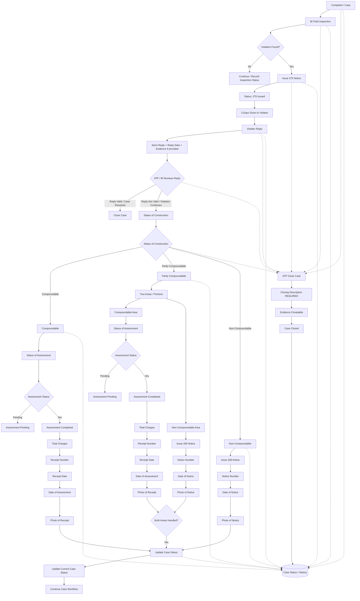

# MCL-BB

MCL-BB is an internal complaint-management application for the Municipal Corporation of Ludhiana Building Branch.

## Stack

- Frontend: React 19, TypeScript, Vite, custom CSS
- Backend: Node.js, Express 5, TypeScript
- Database: PostgreSQL through `pg`
- Development runtime: `tsx`
- File storage: Google Drive API (per-complaint folders & file uploads; temporary staging in `server/uploads/`)
- Integrations: Google Sheets sync, Google Drive service
- OCR: Mistral OCR
- Complaint extraction: Anthropic Claude structured JSON output

## Run locally

From the repository root, use two terminals:

```powershell
cd Frontend
npm install
npm run dev
```

The frontend runs at `http://localhost:5173`.

```powershell
cd server
npm install
npm run dev
```

The backend runs at `http://localhost:5000`.

## Authoritative Statutory Enforcement Workflow (`workflow.pdf`)

For full product specifications, legal citations, and architecture, see [`docs/MASTER.md`](file:///mnt/Data/1YUVRAJ/program/MCL/building%20branch/docs/MASTER.md) and [`docs/implementation_plan.md`](file:///mnt/Data/1YUVRAJ/program/MCL/building%20branch/docs/implementation_plan.md).



### Key Workflow Highlights
1. **Section 270 Notice & 3-Day Window**: If a violation is discovered during inspection, a Section 270 notice is recorded (`Status: 270 Issued`), initiating a statutory 3-day window for the violator to respond.
2. **Violator Response & Joint Review**: Reply statement, receipt timestamp, and optional evidence documents are stored and jointly reviewed by the ATP and BI. Valid replies immediately resolve and close the case; invalid replies proceed to construction status evaluation.
3. **Construction Classification Triad**:
   - **Compoundable**: Assessment workflow (Pending vs Completed). Completed assessment requires Total Charges, Receipt Number, Receipt Date, Date of Assessment, and Photo of Receipt.
   - **Partly Compoundable**: Divided into Two Areas (Compoundable Area Assessment & Receipt; Non-Compoundable Area Section 269 Notice). The system enforces a strict concurrency gate (`Both Areas Handled?`) before proceeding.
   - **Non-Compoundable**: Statutory Section 269 Notice issuance with Notice Number, Date of Notice, and Photo of Notice.
4. **Universal ATP Case Closure Protocol**: An authorized ATP officer may close a case from any milestone. Closure strictly requires a mandatory `Closing Description REQUIRED` and optional `Evidence if Available`.
5. **Central Audit Trail**: Every event, notice, payment receipt, and closure is recorded in `Case Status / History`.

## Complaint registration workflows

### Manual registration

1. Open **New complaint**.
2. Enter citizen, location, and complaint details.
3. Select a Block (Zone is automatically derived from the selected Block), then upload at least one JPG/PNG complaint image.
4. Submit the complaint.
5. The backend validates the fields, derives Zone from Block, maps the responsible BI and ATP, creates a Google Drive folder for the complaint, uploads the evidence files, stores complaint & attachment metadata in PostgreSQL, and opens the confirmation page.

### External document registration

1. In **Register from External Source**, select News, Email, or Other.
2. Upload one or more JPG, PNG, or PDF files.
3. Click **Process Document**.
4. The backend saves the upload, runs OCR, combines the OCR text, and sends it to Claude for structured complaint extraction.
5. The app navigates to a separate review page using the same form layout as manual registration.
6. The extracted fields are prefilled and remain editable.
7. **Submit Complaint** uses the same multipart submission endpoint as manual registration, uploads the original source files to Google Drive, and records `registrationSource` as `document`.

Processing endpoints:

- `POST /api/complaints/process-source`
- `POST /api/complaints/extract-source`
- `POST /api/complaints`

## Main routes

- `/dashboard`
- `/complaints/new`
- `/complaints/new/extracted`
- `/complaints/confirm/:complaintId`
- `/field-inspection`
- `/complaints`
- `/complaints/mine`
- `/complaints/pending`
- `/analytics`
- `/officers`
- `/settings`

## Backend API

- `GET /api/complaints`
- `GET /api/complaints/:complaintId`
- `GET /api/complaints/:complaintId/files`
- `GET /api/complaints/:complaintId/files/:fileId`
- `GET /api/officers`
- `GET /api/officers/roster`
- `GET /api/officers/:officerId`
- `POST /api/complaints/source-upload`
- `POST /api/complaints/process-source`
- `POST /api/complaints/extract-source`
- `POST /api/complaints`
- `POST /api/inspections`

## Layout

The authenticated application shell renders a fixed sidebar and scrolling content area on every page. On narrow screens the sidebar becomes a fixed bottom navigation bar.

## Validation

Frontend build:

```powershell
cd Frontend
npm run build
```

Backend build:

```powershell
cd server
npm run build
```

Both builds currently pass.
