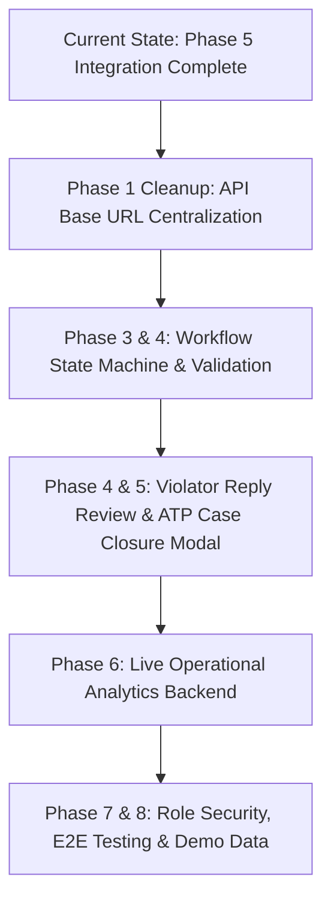

# MCL Building Branch (MCL-BB) — Context Handoff & Progress Report

**Date:** September 24, 2026  
**Repository:** MCL-BB (`/mnt/Data/1YUVRAJ/program/MCL/building branch`)  
**Active Branch:** `uv-dev`  
**Target Milestone:** Full Enforcement Lifecycle Automation, Statutory Data Persistence, and Live Operations Analytics

---

## 1. Executive Summary

The **MCL Building Branch (MCL-BB)** system automates the statutory building violation lifecycle for the Municipal Corporation of Ludhiana (MCL) under the PMC Act 1976.

To date, the core workflow from **JWT Authentication & Role Security (Phase 1 & Phase 2)**, **Complaint Intake** (manual & AI-extracted document upload), **BI Assignment**, **Complaint-to-Case Promotion**, **Field Inspection & Geotagged Evidence**, **Section 270 Notice Issuance**, **Dual Case/Complaint Construction Status Intake**, **Independent Section-Level Construction Processing (Compoundable vs Non-Compoundable)**, **Violator Reply Recording**, and **Role-Based Nav Filtering** has been implemented with backend database persistence in PostgreSQL and evidence hosting in Google Drive.

This document outlines **what has been accomplished so far**, **the current state of the codebase**, and **what remains to be completed** to reach full production and demo readiness.

---

## 2. Progress Breakdown: What Has Been Done Till Now

### 2.1 Authentication & Security (Phase 1 & Phase 2)
- **Database Migrations (`server/migrations/001_create_users_table.sql`)**: Created `users` table (`user_id`, `username`, `phone_number`, `password_hash`, `role`, `is_locked`, `failed_attempts`, `locked_until`) and linked FK to `officers` table.
- **Bcrypt PIN Seeding (`server/migrations/seedUsers.ts`)**: Built idempotent user seeding script hashing officer phone number PINs and admin password.
- **Backend JWT Auth (`server/services/authService.ts` & `server/middleware/auth.ts`)**: Implemented JWT signing/verification, lockout logic (5 failed attempts -> 15 min lock), and `authenticateToken` / `requireRole` middleware.
- **Auth API Routes (`server/routes/authRoutes.ts`)**: Endpoints `POST /api/auth/login` and `POST /api/auth/logout`.
- **Frontend Auth Context (`Frontend/src/context/AuthContext.tsx`)**: React Context provider managing `user`, `token`, `login()`, `logout()`, `localStorage` persistence (`mcl_token`, `mcl_user`), and a global `fetch` interceptor auto-attaching `Authorization: Bearer <token>` to relative `/api` and absolute URL API calls.
- **Real Login UI (`Frontend/src/features/auth/LoginScreen.tsx`)**: Full Login screen handling phone/PIN (officer) and username/password (admin) logins with error/lockout messaging.
- **Role-Based Route Guards & Nav Filtering**: `App.tsx` guards routes by user role (`operator`, `bi`, `atp`, `mtp`, `jc`, `superadmin`); `Sidebar.tsx` dynamically filters nav items per role.
- **Obsolete Analytics Page Removed**: Deleted redundant `AnalyticsPage.tsx` component and removed `/analytics` route & nav item as performance metrics are consolidated into Dashboard and Officers roster views.

### 2.2 Backend Architecture & Database Schema (PostgreSQL)
- **Database Connection & SSL (`server/db/database.ts`)**: Built PostgreSQL client pool with SSL connection handling, transaction support, and fallback capabilities.
- **Statutory Database Tables**:
  - `complaints`: Stores citizen complaints, registration source, block, zone, ward, address, BI/ATP assignments, status, timestamps, Google Drive URLs.
  - `cases`: Tracks formal enforcement cases (`CASE-XXXXXXXXXXXX`), primary complaint linkage, assigned BI & ATP officers, current status, and overall construction status.
  - `case_complaints`: Junction table mapping multiple complaints to a single enforcement case.
  - `field_visits`: Stores field inspection metadata, device GPS coordinates (`latitude`, `longitude`, `accuracy`), building classification, violator details, and visit date.
  - `visit_evidence`: Geotagged evidence photo attachments mapped to field visits.
  - `notices`: Stores Section 270(1) and Section 269 statutory notices with notice numbers, notice dates, area portions, notice types, and Google Drive document URLs.
  - `construction_statuses`: Tracks case-level construction status (`compoundable`, `partly_compoundable`, `non_compoundable`) and overall operational status.
  - `construction_parts`: Granular tracking of section-level completion (`compoundable` area and `non_compoundable` area) with `part_status` (`pending`, `completed`, `in_progress`), `assessment_status` (`pending`, `assessed`), total charges, receipt number, receipt date, receipt photo, and notice links. Includes `ON CONFLICT (construction_status_id, part_type)` upsert support for independent section progression.
  - `violator_replies`: Captures violator reply text, submission date, evidence URLs, and review status.
  - `case_status_history`: Complete audit logging tracking `previous_status`, `new_status`, `changed_by_id`, `changed_by_name`, `reason`, `note`, and `created_at`.
  - `officers`: Roster mapping BI and ATP officers to assigned zones and blocks.

### 2.2 Backend APIs (`server/routes/complaintRoutes.ts`)
- **Complaint Ingestion**:
  - `POST /api/complaints`: Dual-mode complaint registration (manual vs AI-extracted document review) with Google Drive evidence upload and PostgreSQL persistence.
  - `POST /api/complaints/process-source`: OCR document processing using Mistral OCR API for PDF and image sources.
  - `POST /api/complaints/extract-source`: AI structured extraction using Anthropic Claude 3.5 Sonnet to parse unstructured news/email text into structured complaint fields.
  - `GET /api/complaints` & `GET /api/complaints/:complaintId`: Complaint listing (with subqueried case IDs) and hydrated detail views.
  - `GET /api/complaints/:complaintId/files`: Direct fetching of Google Drive attachment metadata.
- **Case & Inspection Management**:
  - `POST /api/complaints/:complaintId/assign`: Transactional promotion of a complaint into an enforcement Case (`CASE-XXXXXXXXXXXX`), creating primary case links and updating status.
  - `GET /api/cases`: Fetch enforcement cases with multi-criteria filtering (status, source, zone, search).
  - `GET /api/cases/:caseId`: Detailed case view fetching linked complaints, assigned officers, notices, violator replies, construction parts state, and audit history.
  - `POST /api/inspections`: BI field inspection endpoint capturing device GPS geolocation, violator information, geotagged photos, Section 270 notice details, and automatic case creation for proactive field visits.
- **Statutory Construction Status Processing**:
  - `GET /api/cases/:caseId/construction-status`: Reads construction status, section completion states (`compoundable` and `nonCompoundable`), notices, violator replies.
  - `POST /api/cases/:caseId/construction-status`: Multipart endpoint supporting compoundable area assessment (charges, receipt #, receipt date, receipt photo), non-compoundable Section 269 notice issuance, violator reply logging, and independent section status evaluation (marking cases complete only when both sections are resolved for partly compoundable cases).

### 2.3 Frontend Capabilities (`Frontend/src/`)
- **Application Shell & Navigation**:
  - `App.tsx`: Hash-based router (`useRouter.ts`) with role selection context and screen routing.
  - `Sidebar.tsx` & `Topbar.tsx`: Desktop fixed sidebar offset and mobile fixed bottom bar; Topbar header with user role selection and text scaling controls.
  - `App.css`: Responsive CSS grid/flex layout, glassmorphism UI elements, dark mode aesthetics, and dynamic viewport scaling.
- **Complaint Workflows**:
  - `ComplaintFormPage.tsx` & `ExtractedComplaintPage.tsx`: Manual registration form & AI document extraction review interface with direct prefilling.
  - `ComplaintDetailPage.tsx`: Hydrated complaint detail screen with Google Drive file previews, promoted case file banner, and direct BI assignment action trigger.
  - `ComplaintsPage.tsx`: Categorized complaint listing (`All`, `Active/Unassigned`, `Assigned/Converted`, `Closed`) with direct links to Case files.
- **Field Inspection & Violation Reporting**:
  - `FieldInspectionPage.tsx`: Proactive and complaint-driven field inspection form with browser Geolocation API integration, officer block-to-zone auto-filtering, geotagged evidence capture, and Section 270 notice recording.
- **Case Management & Statutory Processing**:
  - `CasesPage.tsx`: Enforcement case registry with lifecycle status tabs (`All`, `Active`, `Pending`, `Solved/Completed`), source filters, and direct action triggers.
  - `ConstructionStatusForm.tsx`: Dual-lookup statutory construction status interface (lookup by `CASE-XXXX` or `CMP-XXXX`), featuring dynamic tabs for Compoundable Assessment, Non-Compoundable Section 269 Notice, and Violator Reply, section completion badges, file uploads, and backend persistence feedback.
- **User Preference & Scaling Controls**:
  - `Topbar.tsx`: Functional text scaling popover slider (85% to 115%) with step presets and root font-size scaling.
  - `SettingsPage.tsx`: Application display scaling settings with `localStorage` persistence.
  - `OfficersPage.tsx`: Officer performance roster view matching modern UI reference design.

---

## 3. What Is Left: Remaining Work & Technical Gaps

The remaining tasks have been categorized by priority based on the unified implementation plan (`plan.md`):



### High Priority (Immediate Next Steps)

1. **Centralize API Base URLs (`Phase 1 / Phase 5`)**:
   - **Current Gap**: Multiple components (`complaintApi.ts`, `FieldInspectionPage.tsx`, `OfficersPage.tsx`, `CasesPage.tsx`, `CaseDetailPage.tsx`, `ConstructionStatusForm.tsx`) use hardcoded `http://localhost:5000/api` strings.
   - **Required Action**: Create a central API utility (`Frontend/src/shared/utils/apiConfig.ts`) that exports `API_BASE_URL` using `import.meta.env.VITE_API_BASE_URL ?? "http://localhost:5000/api"` and update all fetch calls.
   - **Files**: `Frontend/src/shared/utils/apiConfig.ts`, `Frontend/src/services/complaintApi.ts`, and page components.

2. **Workflow State Machine Domain Service (`Phase 3`)**:
   - **Current Gap**: Workflow transitions are partially handled inline in SQL queries without explicit state-machine validation against `workflow.pdf`.
   - **Required Action**: Implement a dedicated `workflowService.ts` / `STATUS_TRANSITIONS.ts` on the backend to enforce strict transition rules, valid prerequisites (e.g. non-compoundable area cannot advance without Section 269 notice, partly compoundable requires both areas handled), and role-based permissions.
   - **Files**: `server/services/workflowService.ts`, `server/routes/complaintRoutes.ts`.

3. **Violator Reply Review & Decision Endpoint (`Phase 4 & Phase 5`)**:
   - **Current Gap**: Violator replies are saved under construction status, but there is no explicit ATP/BI review action endpoint to evaluate replies (`Valid -> Resolve/Close Case` vs `Invalid -> Advance to Construction Classification`).
   - **Required Action**: Create `POST /api/cases/:caseId/review-reply` backend endpoint and add a "Review Violator Reply" card/modal in `CaseDetailPage.tsx`.
   - **Files**: `server/routes/complaintRoutes.ts`, `Frontend/src/pages/CaseDetailPage.tsx`.

4. **ATP Statutory Case Closure Modal (`Phase 4 & Phase 5`)**:
   - **Current Gap**: ATP authority to close cases from any stage requires a formal close modal with mandatory `closingDescription` and optional evidence upload.
   - **Required Action**: Implement `POST /api/cases/:caseId/close` endpoint on the backend and build the close case modal in `CaseDetailPage.tsx`.
   - **Files**: `server/routes/complaintRoutes.ts`, `Frontend/src/pages/CaseDetailPage.tsx`.

5. **Live Analytics API Integration (`Phase 6`)**:
   - **Current Gap**: `DashboardPage.tsx` and `AnalyticsPage.tsx` rely on mock data for KPI summary cards, zone charts, and officer performance tables.
   - **Required Action**: Implement `GET /api/analytics/overview` and `GET /api/analytics/officers` using live SQL queries (`COUNT(cases)`, average resolution time from `case_status_history`, officer workload breakdown) and hook them into `DashboardPage.tsx` and `AnalyticsPage.tsx`.
   - **Files**: `server/routes/complaintRoutes.ts`, `Frontend/src/pages/DashboardPage.tsx`, `Frontend/src/pages/AnalyticsPage.tsx`.

### Medium Priority (Security & Data Auditing)

6. **Role-Based Authorization Middleware (`Phase 7`)**:
   - **Current Gap**: API endpoints currently receive officer IDs/roles in body parameters rather than validating token-based headers or middleware constraints.
   - **Required Action**: Implement role validation middleware (`authorizeRole(["BI", "ATP", "JC", "MTP"])`) for mutating routes (`/assign`, `/inspections`, `/construction-status`, `/close`).
   - **Files**: `server/middleware/auth.ts`, `server/routes/complaintRoutes.ts`.

7. **Git Repository Index Cleanup (`Phase 1`)**:
   - **Current Gap**: `server/dist` files are currently modified in working tree and tracked in Git.
   - **Required Action**: Remove build artifacts from Git tracking, verify `.gitignore` excludes `server/dist/` and `server/node_modules/`, create `Frontend/.env.example` and `server/.env.example`.

---

## 4. Summary Matrix of File Status

| Component | File Path | Current Status | Remaining Work |
| :--- | :--- | :--- | :--- |
| **Backend Core** | `server/app.ts` | Fully operational express app | Add CORS env config |
| **Database Pool** | `server/db/database.ts` | Full schema & tables created | Add versioned migration table |
| **Backend Routes** | `server/routes/complaintRoutes.ts` | Intake, assign, inspect, construction status active | Add `/close`, `/review-reply`, `/analytics` |
| **Storage Service** | `server/services/complaintStorage.ts` | Postgres complaint persistence active | Connect audit log helpers |
| **Drive Service** | `server/services/driveService.ts` | Google Drive folder & upload active | Add error retry logic |
| **Frontend Shell** | `Frontend/src/App.tsx` | Hash routing & view state active | Connect live notification counts |
| **Construction Form** | `Frontend/src/pages/ConstructionStatusForm.tsx` | Dual lookup, tabs, section badges active | Connect central API config |
| **Case Detail Page** | `Frontend/src/pages/CaseDetailPage.tsx` | Case timeline & info active | Add ATP Close Case Modal & Reply Review |
| **Dashboard** | `Frontend/src/pages/DashboardPage.tsx` | UI calibrated with headroom formula | Replace mock stats with live analytics API |
| **Analytics** | `Frontend/src/pages/AnalyticsPage.tsx` | Page UI layout ready | Connect to backend `/api/analytics` |

---

## 5. Verification & Build Commands

To verify the current codebase locally:

```powershell
# 1. Frontend Build Verification
cd Frontend
npm run build

# 2. Backend Build Verification
cd ..\server
npm run build

# 3. Running Dev Environment
# Terminal 1 (Frontend):
cd Frontend
npm run dev

# Terminal 2 (Backend):
cd server
npm run dev
```

---

## 6. Next Steps Checklist for Developer

- [ ] 1. Create `Frontend/src/shared/utils/apiConfig.ts` and refactor all frontend `fetch()` calls to use `API_BASE_URL`.
- [ ] 2. Implement `POST /api/cases/:caseId/close` endpoint and add the ATP Close Case modal in `CaseDetailPage.tsx`.
- [ ] 3. Implement `POST /api/cases/:caseId/review-reply` endpoint for joint ATP/BI reply evaluation.
- [ ] 4. Build `GET /api/analytics/overview` and `GET /api/analytics/officers` live SQL endpoints.
- [ ] 5. Connect `DashboardPage.tsx` and `AnalyticsPage.tsx` to the live analytics APIs.
- [ ] 6. Untrack `server/dist/` and `server/node_modules/` in Git.
