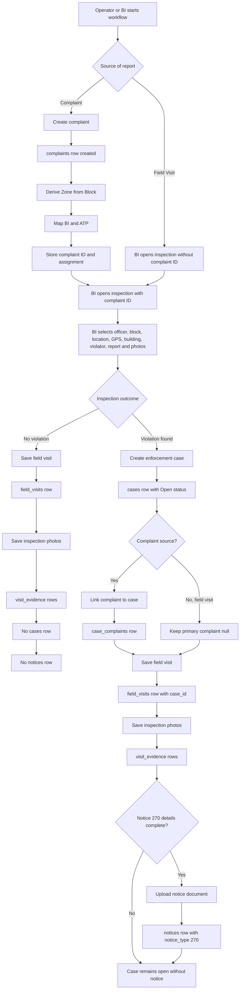
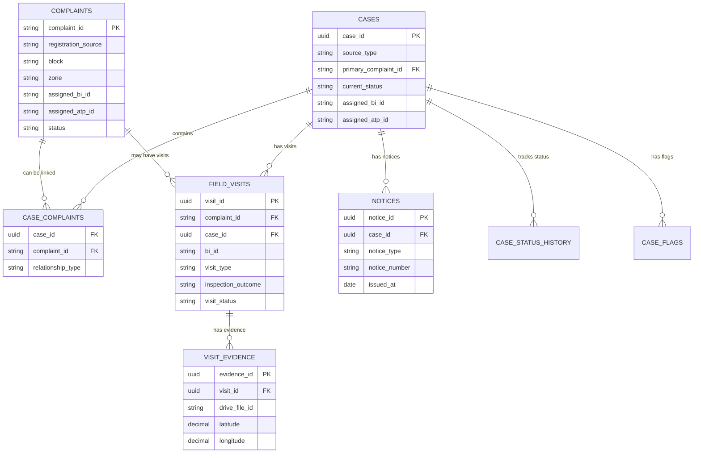

# MCL-BB Inspection Data Flow

**Updated:** 2026-09-16  
**Database:** Neon PostgreSQL  
**Primary API:** `POST /api/inspections`  
**Frontend form:** `Frontend/src/pages/FieldInspectionPage.tsx`

This document describes how the two BI workflows populate the Neon database.

## 1. The two BI cases

### Case 1: Complaint-based inspection

1. An operator registers a complaint.
2. The complaint receives a `complaint_id`.
3. The backend derives the Zone from the selected Block.
4. The backend maps and stores the responsible BI and ATP on the complaint.
5. The BI opens the field inspection form and enters the complaint ID.
6. The BI records the site visit, GPS location, report, building details, and evidence.
7. The BI selects one outcome:
   - **No violation found:** save the visit only; do not create a case or notice.
   - **Violation found:** create an enforcement case, link the complaint to it, save the visit and evidence, and optionally save the Section 270(1) notice.

### Case 2: Proactive field visit

1. The BI starts an inspection without a complaint ID.
2. The BI selects **Field Visit**.
3. The BI enters the site, building, violator, GPS, report, and evidence details.
4. If there is no violation, the visit is saved without a case or notice.
5. If a violation is found, the backend creates a new proactive case, saves the visit and evidence, and optionally saves the Section 270(1) notice.

## 2. High-level flowchart



## 3. Relationship diagram



## 4. Table-by-table population

### 4.1 `complaints`

This table is populated before the BI inspection for Case 1.

| Event | Values written |
|---|---|
| Complaint registration | Complaint ID, citizen details, title, description, Block, Zone, Ward, address, source and status |
| Automatic assignment | Assigned BI ID/name/mobile and assigned ATP ID/name |
| Evidence upload | Complaint/source attachment metadata and Google Drive references |

For Case 2, no row is added to `complaints` by the field inspection form.

### 4.2 `cases`

The current inspection route creates a row only when `inspectionOutcome = 'violation_found'`.

| Flow | `source_type` | `primary_complaint_id` |
|---|---|---|
| Complaint-based violation | `complaint` | Existing complaint ID |
| Proactive field-visit violation | `proactive_bi` | `NULL` |

The row also stores the location, Zone, Block, Ward, GPS coordinates, building identity, assigned BI/ATP, `current_status = 'Open'`, and timestamps.

No `cases` row is created for a no-violation inspection.

### 4.3 `case_complaints`

This junction table is populated only for a complaint-based violation.

```text
case_id            = newly created cases.case_id
complaint_id       = existing complaints.complaint_id
relationship_type  = 'primary'
linked_at          = current timestamp
```

The current route uses `ON CONFLICT (case_id, complaint_id) DO NOTHING`.

### 4.4 `field_visits`

Every submitted inspection creates exactly one `field_visits` row.

| Form value | Database value |
|---|---|
| Complaint source | `complaint_id = entered complaint ID` |
| Field Visit source | `complaint_id = NULL` |
| Violation with complaint | `case_id = newly created case ID` |
| No violation | `case_id = NULL` |
| Proactive violation | `case_id = newly created proactive case ID` |
| Complaint source | `visit_type = 'complaint_visit'` |
| Field Visit source | `visit_type = 'proactive_inspection'` |
| Inspection outcome | `inspection_outcome = 'no_violation'` or `'violation_found'` |
| Description | `report` |
| GPS | `latitude`, `longitude`, `location_accuracy` |
| Building/violator | `building_type`, `violator_name`, `violator_mobile` |
| Submission | `visit_status = 'Submitted'`, `submitted_at = NOW()` |

### 4.5 `visit_evidence`

Each inspection photograph creates one row after it is uploaded to Google Drive.

```text
visit_id          = field_visits.visit_id
file_name         = uploaded/original file name
mime_type         = image MIME type
drive_file_id     = Google Drive file ID
drive_file_url    = Google Drive URL, when available
storage_provider  = 'google_drive'
latitude          = inspection GPS latitude
longitude         = inspection GPS longitude
captured_at       = upload/submission timestamp
```

At least one inspection photograph is required.

### 4.6 `notices`

A notice is optional, but if any notice value is supplied, all of these are required:

- Notice number
- Notice date
- Notice photograph

The current route also requires `inspectionOutcome = 'violation_found'`.

For a valid Section 270(1) notice:

```text
case_id        = cases.case_id
notice_type    = '270'
notice_number  = form notice number
issued_by_id   = reporting BI officer ID
issued_by_name = reporting BI officer name
issued_at      = form notice date
document_name  = uploaded notice file name
drive_file_id  = Google Drive notice file ID
drive_file_url  = Google Drive notice URL
metadata       = { source: 'field_inspection', visitId: field_visits.visit_id }
```

Because `notices.case_id` is required, the notice cannot be stored for a no-violation inspection.

## 5. Exact flows

### Flow A: Complaint + no violation

```text
complaints
  1 existing row
        |
        v
field_visits
  complaint_id = complaint ID
  case_id      = NULL
  inspection_outcome = no_violation
        |
        v
visit_evidence
  one row per inspection photo

cases: no insert
case_complaints: no insert
notices: no insert
```

### Flow B: Complaint + violation

```text
complaints
  1 existing row
        |
        +--> cases
        |      source_type = complaint
        |      primary_complaint_id = complaint ID
        |      current_status = Open
        |
        +--> case_complaints
        |      relationship_type = primary
        |
        +--> field_visits
               complaint_id = complaint ID
               case_id = new case ID
               inspection_outcome = violation_found
                      |
                      v
               visit_evidence (one row per photo)
                      |
                      +--> notices (only when notice fields and notice photo are complete)
```

### Flow C: Field Visit + no violation

```text
field_visits
  complaint_id = NULL
  case_id      = NULL
  visit_type   = proactive_inspection
  inspection_outcome = no_violation
        |
        v
visit_evidence
  one row per inspection photo

complaints: no insert
cases: no insert
case_complaints: no insert
notices: no insert
```

### Flow D: Field Visit + violation

```text
cases
  source_type = proactive_bi
  primary_complaint_id = NULL
  current_status = Open
        |
        v
field_visits
  complaint_id = NULL
  case_id = new case ID
  visit_type = proactive_inspection
  inspection_outcome = violation_found
        |
        v
visit_evidence
  one row per inspection photo
        |
        v
notices
  optional Section 270 row when fully completed
```

## 6. Google Drive relationship

Database rows store metadata and Drive references; binary files are not stored directly in Neon.

| File | Drive parent | Database reference |
|---|---|---|
| Complaint evidence | Complaint folder | Complaint attachment metadata |
| Inspection evidence for complaint | Complaint/inspection folder | `visit_evidence.visit_id` |
| Inspection evidence for proactive case | Case/inspection folder | `visit_evidence.visit_id` |
| Section 270 notice | Case/inspection folder | `notices.drive_file_id` and `notices.drive_file_url` |

## 7. Current implementation boundary

The current `POST /api/inspections` implementation writes:

- `cases` for violations only
- `case_complaints` for complaint-based violations
- `field_visits` for every successful inspection
- `visit_evidence` for every uploaded inspection photograph
- `notices` only for a complete Section 270 notice on a violation

The following tables are part of the broader data model but are not populated by this inspection submission route yet:

- `case_status_history`
- `case_flags`
- `notifications`

Those tables should be populated by later workflow actions such as assignment, notice expiry, escalation, reinspection, approval, and officer notifications.

## 8. Important validation rules

The backend is authoritative and revalidates all fields sent by the frontend:

- Only BI officers can submit inspections.
- The selected BI must be assigned to the selected Block.
- Zone is derived from Block on the server.
- Complaint-based inspections require a valid complaint ID.
- Field Visit inspections do not accept a complaint ID.
- GPS latitude, longitude, and accuracy must be valid.
- At least one inspection photo is required.
- A Section 270 notice is allowed only for `violation_found`.
- A notice requires number, date, and photo together.

