# MCL Building Branch — Master Project Document

> **Master Reference for Product, Workflow, Architecture, Prototype and Scope**

## 1. Project Overview

MCL Building Branch is an internal operational platform for Municipal Corporation Ludhiana's Building Branch. It is evolving beyond complaint registration into a connected system for complaint intake, BI field visits, building violation cases, evidence, notices, follow-up, status tracking, delayed-case monitoring, notifications and analytics.

The system is for internal officers. It is not currently a public portal.

---

# 2. Project Problem

Building-related matters can involve multiple officers, physical visits, evidence, reports, notices, follow-up periods and senior decisions. The system should make it possible to know:

- What was received
- Where it relates to
- Who is responsible
- Whether BI visited
- What evidence exists
- What BI reported
- Whether ATP reviewed it
- Whether a building already has a case
- How long a matter has been pending
- Whether notices were issued
- Which cases are delayed
- Which cases are serious
- Officer workload and performance

---

# 3. Core Objectives

1. Digitize complaint intake.
2. Map complaints to responsible BI and ATP.
3. Digitize BI field visits and evidence.
4. Keep official status changes under authorized roles.
5. Keep complaints and enforcement cases distinct but linkable.
6. Track notices and follow-up.
7. Automatically flag delayed cases.
8. Provide analytics using operational data.
9. Support notifications through a PWA direction.

---

# 4. Core Design Principles

## Internal System First
The current portal is for officers and internal workflow.

## Complaints and Cases Are Different
A complaint is information received about a possible issue. A case is an actionable building/violation matter. They may connect but should not be merged into one concept.

## Evidence Is Mandatory for BI Updates
Every BI update requires:
- Evidence image
- Written description/report

The backend must enforce both requirements.

## BI Does Not Control Official Status
BI performs field work and submits information. ATP and authorized higher roles manage official status.

## Flags Are Separate From Status
Example:
- Status: Pending
- Flag: Delayed
- Score: 87

## Analytics Should Use Real Data
The prototype should connect analytics to the operational database rather than only using mock values.

## Preserve History
Status changes and important field actions should remain traceable.

---

# 5. Users and Roles

## BI — Building Inspector
Responsible for:
- Field visits
- Inspections
- Evidence collection
- Field reports
- Notice recording
- Reinspection

BI cannot arbitrarily change official complaint or case status.

## ATP — Assistant Town Planner
Responsible for:
- Reviewing BI updates
- Routine workflow decisions
- Closing/keeping pending where authorized
- Routing actionable matters
- Monitoring BI responsibility

ATP performance is directly influenced by BI performance under the ATP's responsibility.

## MTP
Higher-level oversight and visibility for serious and delayed matters.

## JC
Higher-level oversight, serious case visibility and performance monitoring.

## Super Admin
Full system oversight, administration and future configuration capability.

---

# 6. System Scope

## In Scope
- Complaint registration
- Manual complaint entry
- Existing document/OCR/AI intake capabilities where applicable
- Officer assignment
- BI field visits
- Evidence upload
- BI reports
- Proactive BI cases
- Complaint-to-case linkage
- Notices
- Notice period tracking
- Reinspection
- Serious enforcement stage
- Status history
- Delayed case flags
- Case scoring/ranking
- Analytics
- Notifications
- PWA

## Not Immediate Prototype Scope
- Public citizen portal
- Full WhatsApp integration
- Advanced offline PWA
- Complete legal automation
- Perfect role-specific dashboards
- Fully configurable workflow engine
- Complex scoring configuration

---

# 7. Core Workflows Overview

## 7.1 Two Intake Streams
The system supports two core intake streams:
- **Workflow A — Complaint-Driven**: External complaint intake (manual or OCR document) followed by field verification.
- **Workflow B — BI-Initiated Case**: Proactive field detection by Building Inspectors.

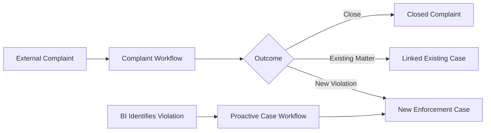

## 7.2 The Statutory Enforcement Lifecycle (`workflow.pdf`)
Once an actionable violation is identified (from either complaint verification or proactive inspection), the case enters the authoritative statutory enforcement lifecycle under the Punjab Municipal Corporation Act, 1976 (PMC Act), as specified in `workflow.pdf`:

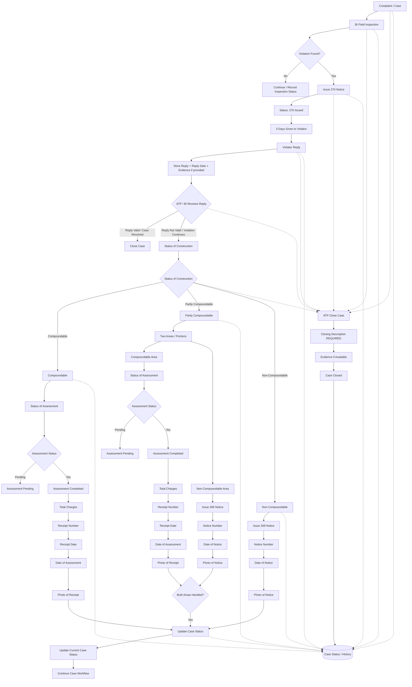


---

# 8. Complaint Workflow

## 8.1 Complaint Sources
Complaints may arrive through:
- Email
- Post
- Physical documents
- Other external sources
- Manual entry

## 8.2 Intake Data
The receiving officer records or verifies:
- Title
- Description
- Location
- Zone
- Ward
- Area/block
- Source
- Supporting documents/images

Public complaints do not require geotagging.

## 8.3 Assignment
The system maps:
- Responsible BI
- Responsible ATP

based on administrative/geographical responsibility.

## 8.4 Notifications
After creation:
- BI is notified
- ATP is notified

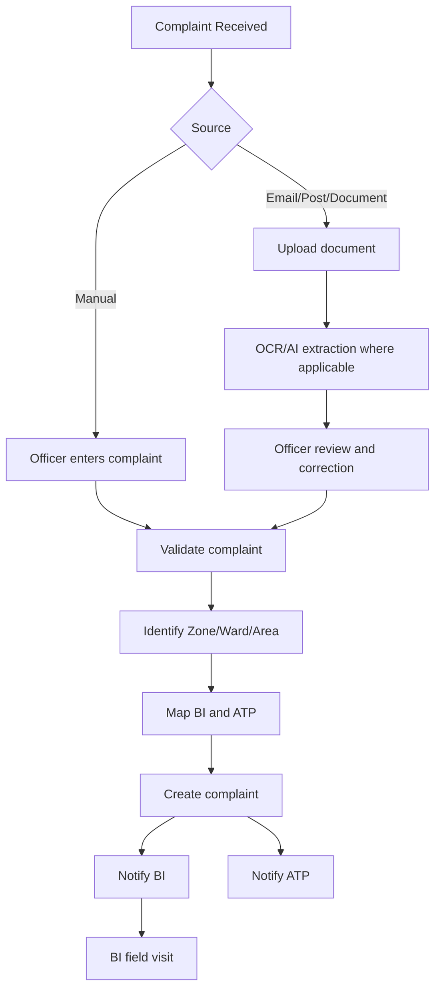

---

# 9. BI Complaint Visit

BI visits the location mentioned in the complaint.

BI must submit:

1. Evidence image proving the visit
2. Description/report explaining the situation

The backend must reject incomplete submissions.

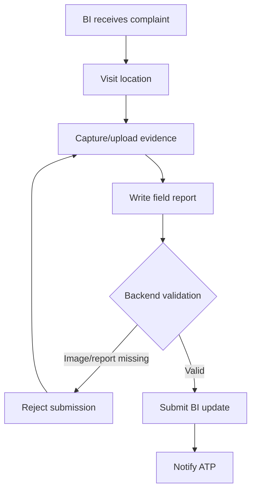

---

# 10. ATP Review of Complaint

ATP reviews the BI update.

Possible outcomes:

## Close
No actionable issue exists.

## Existing Case
The building/location already has a running matter. The complaint remains a record and is linked where possible.

## New Actionable Violation
No relevant existing case exists and BI finds an actionable violation. A new case is created/initiated.

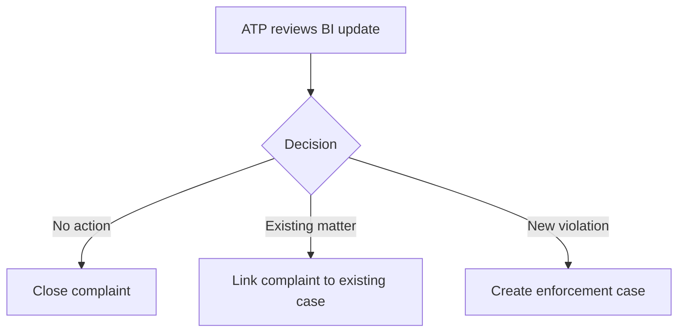

---

# 11. Proactive BI Case Workflow

BI may independently identify a violation without receiving a complaint.

The BI creates a case with:
- BI identity
- Zone/ward/area
- Building/location information
- Latitude
- Longitude
- Evidence
- Description/report
- Other inspection fields

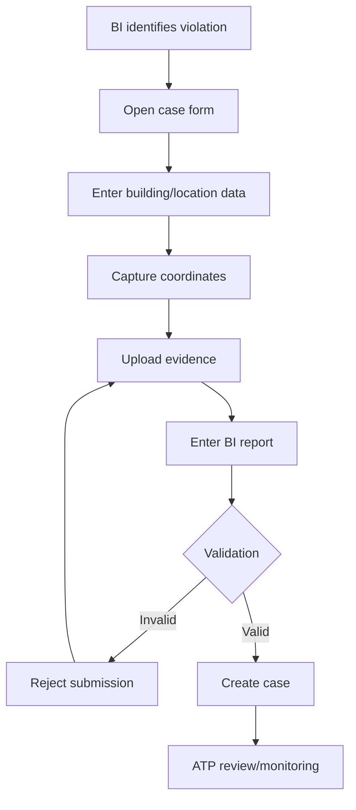

---

# 12. Connecting Complaints and Cases

A complaint can:
1. Close without becoming a case
2. Be linked to an existing case
3. Lead to a new enforcement case

A proactive BI inspection starts directly as a case.

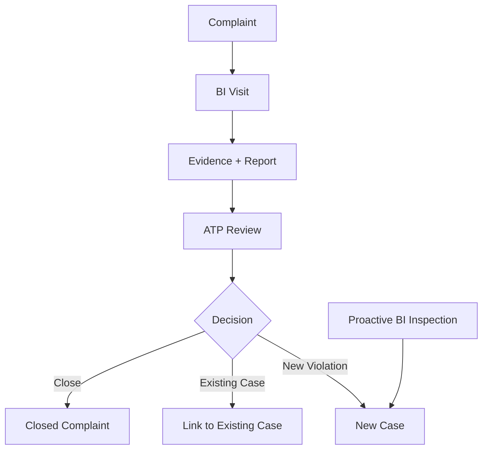

Important implementation principle: a complaint about a building with an existing matter should not automatically create an unrelated duplicate case.

---

# 13. Evidence and Geolocation

Every BI update requires evidence and a report.

Geolocation implementation still requires final technical confirmation.

Possible approaches:
- Application/native camera with coordinates
- Browser/device geolocation during capture
- Existing geotagged image
- Separate image + latitude/longitude

Recommended prototype direction:
- Store evidence image
- Store latitude
- Store longitude
- Avoid depending only on EXIF metadata until tested

---

# 14. BI Field Inspection & Section 270 Notice Workflow

When a complaint is assigned or a proactive case is initiated, the Building Inspector (BI) conducts an on-site physical inspection.

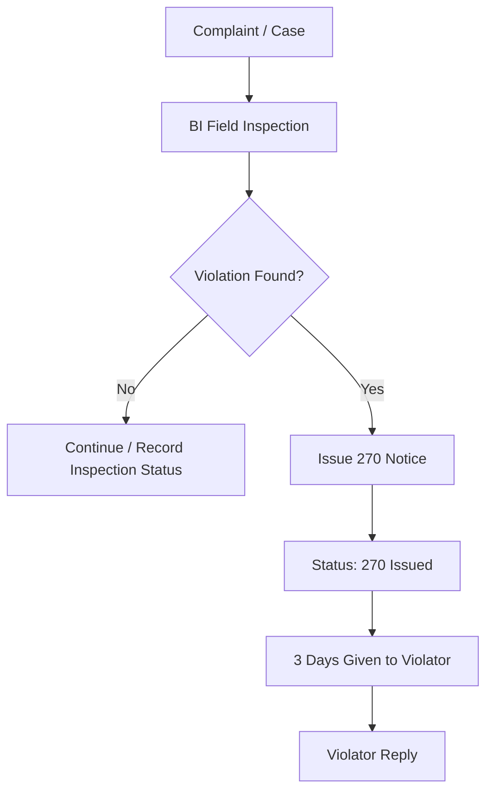

## 14.1 Inspection Outcome
1. **No Violation Found**:
   - BI logs inspection details, geotagged photo evidence, and written report.
   - Status updated to `Continue / Record Inspection Status`. Case either remains in monitoring or is submitted to ATP for closure.
2. **Violation Found**:
   - BI issues statutory Section 270 Notice under the PMC Act, 1976.
   - System updates case status to `Status: 270 Issued`.
   - Records notice number, issue date, and uploaded photo of physical notice.

## 14.2 Statutory 3-Day Response Window
- Under Section 270, the property owner/violator is legally granted **3 Days** to respond or rectify the violation (`3 Days Given to Violator`).
- A backend timer tracks this statutory window.

---

# 15. Violator Reply & ATP / BI Reply Review

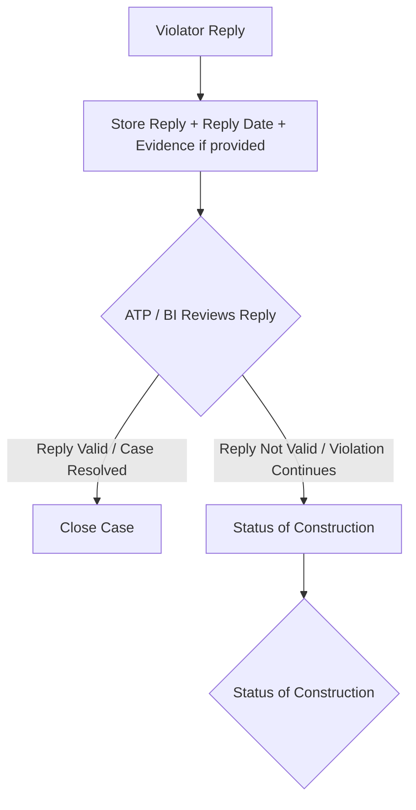

## 15.1 Storing the Reply
When the violator submits their explanation or evidence:
- **Violator Reply**: Response statement or legal representation.
- **Reply Date**: Timestamp of receipt.
- **Evidence Documents**: Supporting sanction plans, NOCs, ownership proofs, or photographic evidence.

## 15.2 Joint Supervisory Review
ATP and BI jointly review the submitted reply:
1. **Reply Valid / Case Resolved**:
   - The violator proves lawful sanction, permission, or prompt rectification.
   - The case proceeds immediately to `Close Case`, logged into `Case Status / History`.
2. **Reply Not Valid / Violation Continues**:
   - If the reply is rejected or illegal construction is ongoing, the case transitions to `Status of Construction` for statutory legal classification.

---

# 16. Construction Status & Three Enforcement Pathways

When a violation continues after notice review, the matter is classified according to municipal bylaws into one of three distinct tracks:

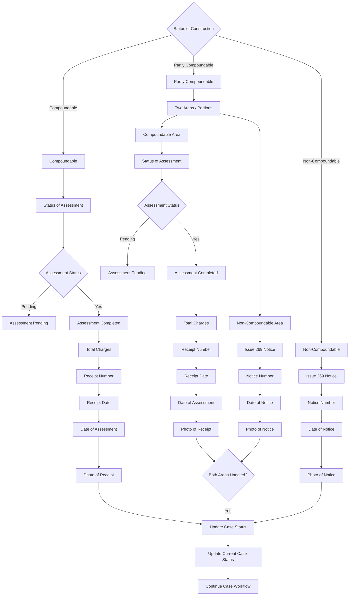

## 16.1 Pathway 1: Compoundable
Applicable when deviations are minor and permissible for compounding/regularization under MCL building bylaws.
- Enters `Status of Assessment`.
- **Assessment Status** check:
  - **Pending**: Case flagged as `Assessment Pending` until municipal town planning assessment is finalized.
  - **Yes (Completed)**: Upon payment, the system captures full fiscal and receipt metadata:
    1. `Total Charges`: Assessed compounding fee amount (INR).
    2. `Receipt Number`: Official municipal treasury receipt number.
    3. `Receipt Date`: Date of payment receipt.
    4. `Date of Assessment`: Date assessment order was approved.
    5. `Photo of Receipt`: Uploaded physical treasury/challan receipt scan.
- On receipt verification, advances to `Update Case Status`.

## 16.2 Pathway 2: Partly Compoundable (Dual-Track Handling)
Applicable when a property contains both regularizable deviations and severe illegal construction.
- The property is split into `Two Areas / Portions`:
  1. **Compoundable Area**: Undergoes full Assessment & Payment workflow (`Status of Assessment` → `Assessment Pending` or `Assessment Completed` with Total Charges, Receipt Number, Receipt Date, Date of Assessment, Photo of Receipt).
  2. **Non-Compoundable Area**: Enforces statutory demolition notice under Section 269 (`Issue 269 Notice` with Notice Number, Date of Notice, Photo of Notice).
- **Synchronization Gate (`Both Areas Handled?`)**:
  - The system enforces a strict concurrency rule: both the compounding payment verification AND the Section 269 notice issuance must be verified before the case can advance (`Update Case Status`).

## 16.3 Pathway 3: Non-Compoundable (Serious Enforcement / Section 269)
Applicable when the construction violates non-negotiable zoning rules, major setbacks, or structural safety.
- Bypasses compounding assessment entirely.
- Enters statutory Section 269 notice issuance:
  1. `Issue 269 Notice`: Statutory demolition/sealing order under PMC Act Section 269.
  2. `Notice Number`: Formal municipal file / notice registration number.
  3. `Date of Notice`: Statutory issuance date.
  4. `Photo of Notice`: Uploaded physical copy of Section 269 notice served at property.
- Advances to `Update Case Status`.

## 16.4 Workflow Continuation
From `Update Case Status`:
- System transitions to `Update Current Case Status`.
- Proceeds to `Continue Case Workflow` for post-notice enforcement monitoring, demolition scheduling, or final archival.

---

# 17. Universal ATP Case Closure Protocol

To preserve administrative agility and legal oversight, the Assistant Town Planner (ATP) has statutory authority to close a case at any stage of the workflow.

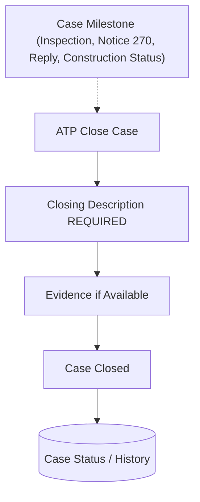

## 17.1 Universal Access Points
ATP can trigger `ATP Close Case` directly from:
- `Complaint / Case` (Intake stage)
- `BI Field Inspection` (Pre-notice stage)
- `Issue 270 Notice` (Notice active stage)
- `Violator Reply` (Post-reply stage)
- `ATP / BI Reviews Reply` (Review stage)
- `Status of Construction` (Compoundable or Non-Compoundable stage)

## 17.2 Mandatory Closure Requirements
To prevent arbitrary closures and maintain full legal accountability, the system enforces:
1. **Closing Description REQUIRED**: Mandatory narrative justification explaining the legal or administrative grounds for closure.
2. **Evidence if Available**: Optional supporting documentation (e.g., sanctioned building plan, court stay order, demolition completion photo, receipt voucher).
3. **Case Closed**: Transition to terminal state.
4. **Logged to Audit Log**: Immediate event creation in `Case Status / History`.

---

# 18. Case Status / History & Audit Trail

The system maintains a centralized, tamper-evident audit repository (`Case Status / History`).

Every milestone in `workflow.pdf` publishes structured event entries into `Case Status / History`:
- Complaint registration & assignment
- Field inspection reports & photos
- Section 270 notice issuance
- Violator reply submission & review outcome
- Compounding assessment creation & receipt photo upload
- Section 269 notice details & notice photo
- Universal ATP closures with required description
- State transitions and officer actor IDs

---

# 19. Status Ownership

## BI
Can:
- Submit field updates
- Upload evidence
- Write reports
- Record notice information

Cannot:
- Change official complaint/case status arbitrarily

## ATP
Handles routine review and status decisions, including issuing notices and closing cases under authorized criteria.

## MTP / JC / Super Admin
Receive higher-level visibility and handle serious/authorized decisions according to administrative authority.

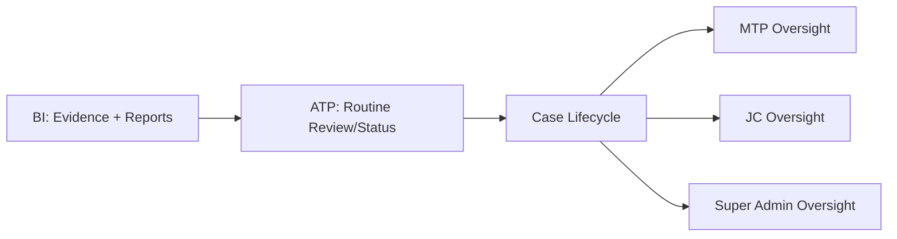

---

# 19. Automatic Flagging

Flags are separate from status.

A case can be:
- Pending
- Delayed flag
- Score 82

The system automatically evaluates:
- Time in current state
- Overall duration
- Severity/stage

Current prototype baseline:
> Approximately 3 weeks before automatic delayed flagging

The threshold should later become configurable.

Flagged cases:
- Appear in dedicated analytics
- Are ranked by score
- Become visible to higher authorities
- Can generate notifications

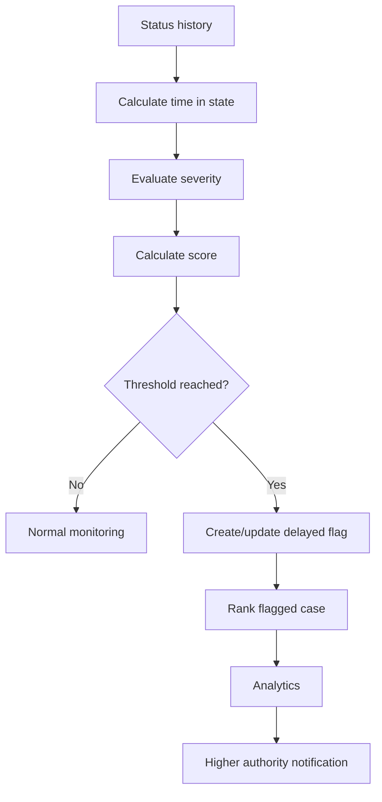

---

# 20. Case Scoring

The final scoring formula is not yet decided.

Primary factors:
1. Time stuck in state / total duration
2. Severity/stage

Conceptual direction:

```text
Case Score =
Time Factor
+ Severity Factor
+ Future Administrative Factors
```

Possible future factors:
- Number of follow-ups
- Linked complaints
- Repeated delays
- Notice expiry
- Administrative priority

For the prototype, keep the formula simple and explainable.

---

# 21. Analytics

Analytics is a major priority because non-technical stakeholders are highly interested in it.

## Access Direction
- BI: no analytics
- ATP: analytics
- MTP: analytics
- JC: analytics
- Super Admin: analytics

For now, analytics can remain broadly similar for ATP and above.

## BI Metrics
- Assigned matters
- Cases identified
- Completed
- Closed
- Pending
- Daily performance
- Weekly performance
- Monthly performance
- Time in stages

## ATP Context
ATP performance should reflect the performance of BIs under that ATP's responsibility.

## Higher Oversight
Show:
- Pending
- Closed
- Flagged
- High-severity
- BI performance
- ATP context
- Trends

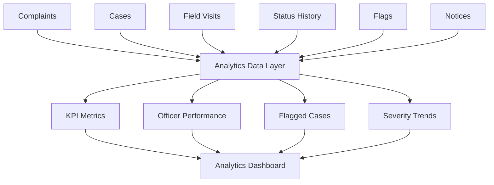

Analytics should derive from operational data rather than manually maintained counters where possible.

---

# 22. Notifications

Important notification events:
- Complaint assigned
- BI update submitted
- ATP review required
- Section 270 issued
- Reminder before expiry
- Notice period expired
- Section 269 serious stage
- Case delayed/flagged

Notifications support workflow but do not replace status history.

---

# 23. PWA Requirements

The application should become a PWA.

Immediate focus:
> Notifications

Prototype PWA scope:
- Manifest
- Installable application
- Service worker
- Basic notification infrastructure
- In-app notification center

Later:
- Advanced offline support
- Background sync
- More advanced push infrastructure

---

# 24. Proposed Modules

1. Complaint Intake
2. Assignment
3. BI Field Work
4. Case Management
5. Notice Management
6. Workflow and Status
7. Flags and Scoring
8. Analytics
9. Notifications
10. Administration

---

# 25. Data Architecture Direction

This is a proposed direction and must be reconciled with the actual current PostgreSQL schema before migrations.

## complaints
Stores complaint intake.

Possible concepts:
- complaint_id
- source
- title
- description
- location
- zone
- ward
- area
- assigned BI
- assigned ATP
- current status
- timestamps

## cases
Stores enforcement/building violation matters.

Possible concepts:
- case_id
- source type
- primary complaint
- building/location identity
- latitude
- longitude
- assigned BI
- assigned ATP
- current status
- severity
- timestamps

## case_complaints
Links multiple complaints to one case.

## field_visits
Stores BI visits and reports.

## visit_evidence
Stores images/evidence metadata.

## notices
Stores:
- Notice type
- Number
- Issuer
- Date
- Expiry
- Documents
- Classification

## case_status_history
Tracks status transitions.

## case_flags
Stores delayed/escalation flags separately from status.

## notifications
Stores in-app/PWA notification records.

---

# 26. Conceptual ER Diagram

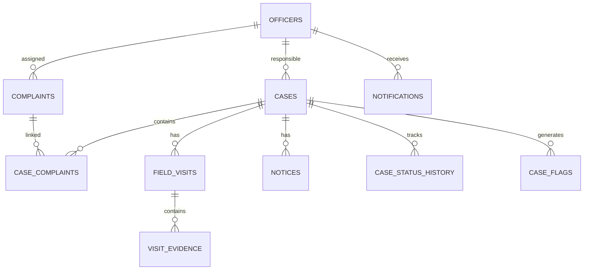

---

# 27. Backend Principles

## Server-Side Validation
Backend validates:
- Required evidence
- Required report
- Role authorization
- Valid status transitions
- Required notice data

## Workflow Authority
Frontend requests actions.

Backend:
1. Validates
2. Performs transition
3. Stores history
4. Generates notifications where needed

## Preserve Existing Work
Do not unnecessarily break current complaint functionality.

Integrate incrementally.

---

# 28. Frontend and UX Direction

Important screens:
1. Dashboard
2. Complaint list
3. Complaint detail
4. BI work queue
5. BI field visit form
6. ATP review
7. Case detail
8. Status timeline
9. Notice details
10. Flagged cases
11. Analytics
12. Notifications

UX principle:

```text
Complaint
↓
Assignment
↓
Field Visit
↓
Evidence
↓
Report
↓
Review
↓
Case
↓
Action
```

A non-technical stakeholder should be able to follow this story visually.

---

# 29. Prototype Scope

## P0 — Must Work
- Existing complaint registration stable
- Assignment
- BI evidence
- BI report
- Backend validation
- ATP review
- Case creation
- Complaint-to-case linkage
- Proactive case
- Real-data analytics
- Flagged cases

## P1 — Strong Demo Value
- Section 270
- 3-day period
- Section 269
- Status timeline
- Notifications
- PWA setup

## P2 — Later
- WhatsApp
- Advanced scoring
- Fine-grained role analytics
- Full legal automation
- Advanced offline PWA

---

# 30. Prototype Demo Story

## Story A — Complaint to Case
1. Register complaint
2. Assign BI and ATP
3. BI visits
4. BI uploads evidence
5. BI writes report
6. ATP reviews
7. Show close/existing case/new case
8. Create actionable case
9. Demonstrate Section 270
10. Demonstrate expiry
11. Demonstrate reinspection
12. Demonstrate Section 269
13. Show analytics

## Story B — Proactive Case
BI independently:
- Finds violation
- Creates case
- Adds location
- Adds evidence
- Adds report

## Story C — Delayed Case
Show seeded/realistic old case:
- Old state timestamp
- Automatic flag
- Score
- Ranking
- Higher visibility

---

# 31. Single-Developer Plan

## Primary Developer
Focus on:
- Integration
- Database
- Backend
- Frontend wiring
- Analytics

## Yuvi Support
Focus on difficult/high-leverage work:
- Architecture
- Schema review
- Workflow edge cases
- Debugging blockers
- Analytics/scoring
- Notification/PWA decisions
- Documentation

## Phases

### Phase 1 — Stabilize
- Compare current branches
- Choose base
- Verify working features
- Find mock data
- Freeze scope

### Phase 2 — Data Foundation
- Cases
- Visits
- Evidence
- Status history
- Flags

### Phase 3 — Connected Workflow
- Complaint → BI visit
- BI validation
- ATP review
- Complaint → case
- Proactive case

### Phase 4 — Analytics
- Replace mocks
- KPI cards
- Pending/closed
- BI performance
- ATP context
- Flagged ranking

### Phase 5 — Demo Polish
- Realistic seed data
- Fix navigation
- Loading/error states
- Demo rehearsal
- Basic PWA

---

# 32. Two-Developer Plan

## Developer A — Backend/Data
- PostgreSQL schema
- Migrations
- Cases
- Visits/evidence
- Notices
- Status history
- Flags/scoring
- Notifications API
- Analytics queries

## Developer B — Frontend/UX
- Complaint/case screens
- BI forms
- ATP review
- Analytics dashboard
- Flagged cases
- Timeline
- PWA
- Notification UI
- Demo polish

Daily agreement should cover:
- API contracts
- Schema changes
- Workflow transitions

---

# 33. Yuvi's Support Role

Yuvi does not need to own all implementation.

Highest-value contribution:
- Architecture decisions
- Schema review
- Complaint/case relationship
- Difficult debugging
- Analytics design
- Scoring design
- Documentation
- Stakeholder presentation

---

# 34. Suggested 1–1.5 Week Prototype Timeline

## Day 1
- Compare `ad-dev` and `uv-dev`
- Choose base
- Run application
- Confirm database
- Freeze scope

## Day 2
- Connect BI form to backend
- Evidence upload
- Report validation

## Day 3
- Case model
- Complaint-to-case link
- ATP review
- Status history

## Day 4
- Proactive BI case
- Coordinates
- Evidence
- Reports

## Day 5
- Real analytics
- Pending/closed
- BI metrics
- ATP context

## Day 6
- Flagging
- Score ranking
- Notice demo data

## Day 7
- Notifications
- PWA basics
- End-to-end test

## Buffer
- Bugs
- UI polish
- Demo preparation
- Workflow corrections

---

# 35. What Must Not Delay the Prototype

Do not spend excessive prototype time on:
- Perfect legal automation
- Complete AI redesign
- Full role hierarchy
- Complex configurable scoring
- Full WhatsApp
- Perfect EXIF geotagging
- Extensive offline PWA
- Rebuilding working modules

Important principle:

> Prefer connecting existing screens to real data over building disconnected new screens.

---

# 36. Future Scope

Potential later work:
- Advanced RBAC
- Configurable officer/area mapping
- Advanced analytics
- Heatmaps and trends
- Configurable scoring
- WhatsApp integration
- Full offline PWA
- Building identity matching
- Duplicate complaint detection
- AI case summarization

---

# 37. Open Decisions and Verification

## Legal Verification
Verify official requirements for:
- Section 269
- Section 270
- Classifications
- Required documents

## Geotagging
Finalize:
- Camera approach
- Permission model
- Coordinate capture

## Score Formula
Finalize after workflow stabilizes.

## Flag Threshold
Current baseline:
- Approximately 3 weeks

Later configurable.

## Role-Specific Analytics
Prototype:
- Broadly same for ATP and above

Later:
- Fine-grained access.

## Existing Case Matching
Define how to identify:
- Same building
- Same location
- Existing matter

---

# 38. Master End-to-End Workflow

The complete end-to-end operational lifecycle combines complaint intake, proactive BI inspections, the statutory enforcement procedure established in `workflow.pdf`, and supervisory analytics.

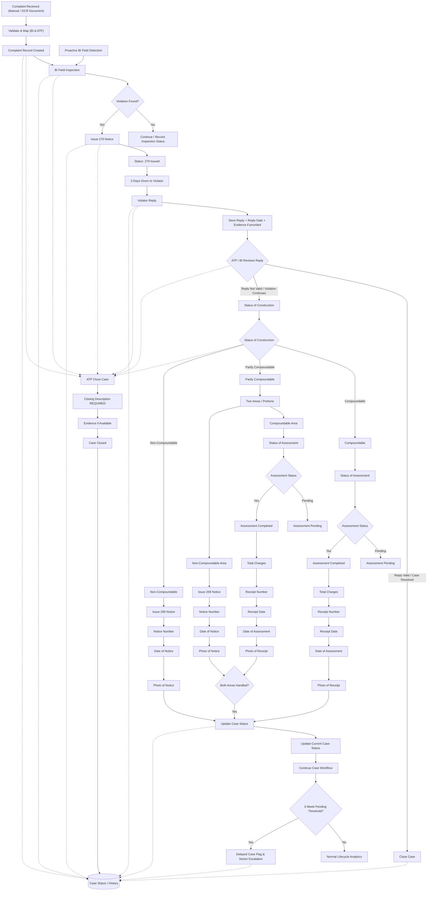

---

# 39. Implementation Priorities

## Priority 1 — Reality
Confirm:
- Current branch state
- What works
- What is mock
- Missing backend connections

## Priority 2 — Connected Workflow
Make this real:

```text
Complaint
→ Assignment
→ BI Visit
→ Evidence
→ Report
→ ATP Review
→ Case
```

## Priority 3 — Analytics
Because stakeholders care about it:
- Real data
- KPIs
- Performance
- Flagged cases

## Priority 4 — Notice Workflow
Demonstrate:
- 270
- Timer
- Reinspection
- 269

## Priority 5 — Notifications/PWA
Minimum viable implementation.

---

# 40. Definition of a Successful Prototype

A successful prototype should allow a non-technical stakeholder to understand:

> A complaint enters the system. Responsible officers are assigned. BI visits and submits evidence and a report. ATP reviews the matter. If an actionable violation exists, it becomes or links to a case. Notices and follow-up can be tracked. Serious matters gain higher-level visibility. Delayed cases are automatically flagged and ranked. Analytics show workload, performance and pending matters. Notifications support timely action.

Technically, the prototype should demonstrate:
- Real database persistence
- Connected frontend/backend
- Evidence handling
- Workflow validation
- Status history
- Complaint/case relationship
- Analytics from real operational data
- Delayed flags
- Scoring direction
- Notification/PWA readiness

---

# 41. Operational API Endpoints & Inspection Data Flow

## 41.1 Primary API Endpoints

### 1. `POST /api/inspections`
Handles submission of BI field visits for both complaint-driven investigations and proactive field visits.
- **Input**: Multipart form data containing:
  - `sourceOfReport`: `"complaint"` | `"field_visit"`
  - `inspectionOutcome`: `"no_violation"` | `"violation_found"`
  - `reportingOfficer`: Officer ID (BI designation mandatory; block assignment verified)
  - `block`: Target Block (Server derives Zone automatically)
  - `location`: Property address / location
  - `buildingType`: Building classification (`"Commercial"`, `"Residential"`, `"Industrial"`, `"Other"`)
  - `otherBuildingType`: Custom classification if buildingType is `"Other"`
  - `violatorName`: Name of violator
  - `mobileNumber`: Contact number (optional)
  - `description`: Written field inspection report
  - `latitude`, `longitude`, `accuracy`: Geotagged coordinates captured on device
  - `complaintId`: Required if `sourceOfReport === "complaint"`
  - `noticeNumber`, `noticeDate`: Section 270 notice metadata (when issued)
  - `inspectionPhotos`: Mandatory inspection evidence image files (stored in Google Drive)
  - `noticePhoto`: Optional Section 270 notice image file (stored in Google Drive)

### 2. `GET /api/complaints/:complaintId/files`
Fetches Google Drive file references associated with a complaint folder (categorized into source documents, preliminary evidence, and resolution photos).

### 3. `GET /api/officers/roster`
Returns the officer roster mapping Building Inspectors (BIs) and Assistant Town Planners (ATPs) to their respective assigned Zones and Blocks.

---

## 41.2 Table-by-Table Database Population

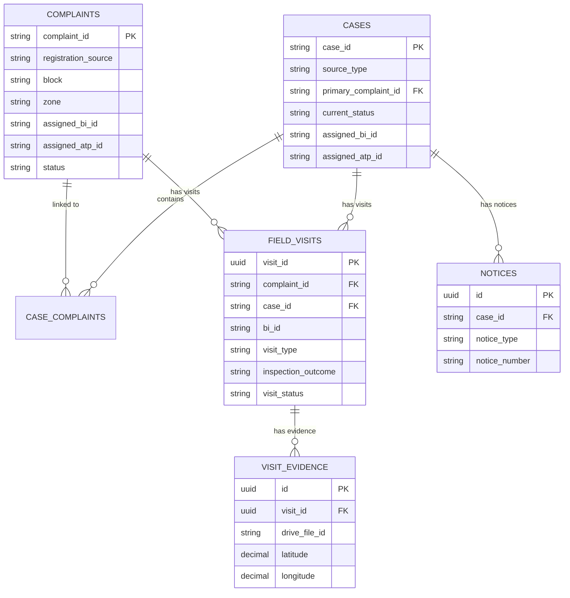

### Table Population Logic

| Table | Populated When | Key Fields / Logic |
|---|---|---|
| `complaints` | Complaint intake | Stores complaint details, derived Zone, mapped BI & ATP, attachments, Google Drive URL. |
| `cases` | `inspectionOutcome = 'violation_found'` | Creates enforcement case row. `source_type` = `'complaint'` or `'proactive_bi'`. Stores location, coordinates, building identity, assigned officers, `current_status = 'Open'`. |
| `case_complaints` | Complaint-driven violation found | Links `case_id` to `complaint_id` with `relationship_type = 'primary'`. |
| `field_visits` | Every submitted inspection | Creates exactly one row (`visit_type = 'complaint_visit'` or `'proactive_inspection'`). Links `complaint_id` and `case_id` where applicable. |
| `visit_evidence` | Every inspection photograph | Uploads photos to Google Drive inspection subfolder and inserts metadata rows referencing `visit_id`. |
| `notices` | Section 270 notice details complete | Uploads notice photo to Google Drive and inserts notice row (`notice_type = '270'`, `case_id`, metadata JSON). |

---

## Final Guiding Principle

MCL Building Branch should not become a collection of unrelated features.

Every feature should improve at least one of:

1. Complaint workflow
2. BI field workflow
3. Case/enforcement lifecycle
4. Accountability
5. Analytics
6. Timely action
7. Stakeholder understanding

If it does not improve one of these, it should not take priority during the current prototype phase.

---

## Document Status

**Document:** MASTER.md

**Purpose:** Single master reference for project discussion, workflow, architecture, scope and implementation planning.

**Current prototype target:** Approximately 1–1.5 weeks.

**Workflow source:** Clarified project discussion. Legal details explicitly marked for future official verification.

