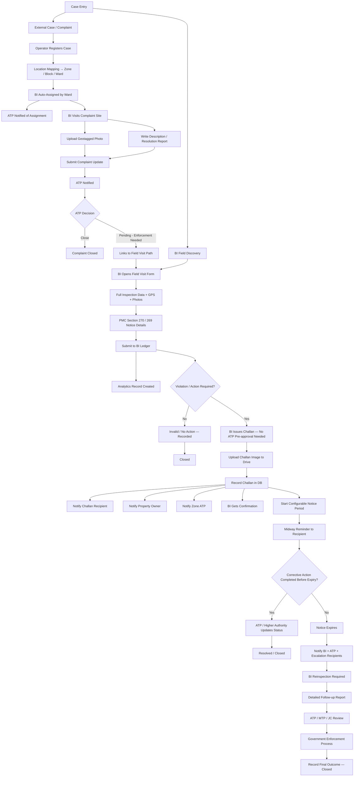

# MCL-BB — Product & Implementation Plan v3

**Last updated:** 2026-09-14

---

## Product Direction

MCL-BB is a Building Violation Detection, Challan, Notice and Enforcement
Workflow Management System for Ludhiana Municipal Corporation. It handles
external complaint/document intake, BI field enforcement, and now includes
a dedicated **BI Performance Analytics** layer to drive accountability and
field productivity.

---

## Two Case Entry Paths

### A. External Case (Complaint-Driven)

Operator / ATP / authorized user receives complaint via mail, document,
news, or direct intake → creates case → location mapping → BI assignment.

Existing OCR pipeline retained: upload → Mistral OCR → Claude structured
extraction → operator review/edit → registration.

**BI's role in complaint resolution is intentionally minimal:**
- BI visits the site
- Uploads one **geotagged photo** (evidence of visit)
- Submits a **short description / resolution report**
- ATP reviews and decides: Close or Pending further action

BI does **not** fill a full inspection form for complaint resolution.
That data is captured in the BI Field Visit (Path B) if enforcement is
warranted.

### B. BI Field Visit (Proactive Enforcement)

BI independently discovers a suspected violation in the field → opens
Field Visit form → fills complete inspection data → submits to BI ledger.

This is the **primary source** of enforcement data and BI analytics.

**Both paths enter the same operational lifecycle after their entry point.**
A field visit may optionally reference a complaint (`complaint_id` nullable
FK) if the visit was triggered by one — but the data structures remain
separate because the data shapes are fundamentally different.

---

## Updated Core Workflow



---

## DB Schema

Two separate tables for the two BI roles. Never merged.

### Core Tables

```sql
-- Master complaints table
complaints (
  id                  UUID PRIMARY KEY DEFAULT gen_random_uuid(),
  complaint_id        VARCHAR UNIQUE,          -- e.g. CMP-2026-001
  registration_source VARCHAR,                 -- 'manual' | 'document' | 'field'
  name                VARCHAR,
  phone               VARCHAR,
  email               VARCHAR,
  zone                VARCHAR,
  block               VARCHAR,
  ward                VARCHAR,
  address             TEXT,
  title               VARCHAR,
  description         TEXT,
  drive_folder_url    TEXT,                    -- parent Drive folder, never exposed to frontend
  status              VARCHAR DEFAULT 'Registered',
  bi_officer_id       UUID REFERENCES officers(id),
  atp_officer_id      UUID REFERENCES officers(id),
  created_at          TIMESTAMPTZ DEFAULT now(),
  updated_at          TIMESTAMPTZ DEFAULT now()
)

-- Officers: BI, ATP, MTP, JC all in one table with role column
officers (
  id          UUID PRIMARY KEY DEFAULT gen_random_uuid(),
  name        VARCHAR NOT NULL,
  phone       VARCHAR,
  email       VARCHAR,
  role        VARCHAR NOT NULL,    -- 'BI' | 'ATP' | 'MTP' | 'JC' | 'Operator'
  zone        VARCHAR,
  block       VARCHAR[],           -- array: BIs cover multiple blocks
  employee_id VARCHAR UNIQUE,
  created_at  TIMESTAMPTZ DEFAULT now()
)
```

### Path A — Complaint Resolution Update (minimal BI input)

```sql
-- BI's update on a complaint: just photo + description
bi_complaint_updates (
  id               UUID PRIMARY KEY DEFAULT gen_random_uuid(),
  complaint_id     UUID NOT NULL REFERENCES complaints(id),
  bi_officer_id    UUID NOT NULL REFERENCES officers(id),
  geotagged_photo  TEXT,           -- Drive file URL (proxied, never direct)
  gps_lat          NUMERIC(10,7),
  gps_lng          NUMERIC(10,7),
  description      TEXT NOT NULL,
  submitted_at     TIMESTAMPTZ DEFAULT now()
)
```

### Path B — BI Field Visit / Proactive Inspection (full data)

```sql
-- Full proactive enforcement inspection
bi_field_visits (
  id                    UUID PRIMARY KEY DEFAULT gen_random_uuid(),
  complaint_id          UUID REFERENCES complaints(id),   -- nullable: proactive visits have no complaint
  bi_officer_id         UUID NOT NULL REFERENCES officers(id),
  atp_officer_id        UUID REFERENCES officers(id),     -- auto-mapped from block
  zone                  VARCHAR,
  block                 VARCHAR,
  ward                  VARCHAR,
  gps_lat               NUMERIC(10,7),
  gps_lng               NUMERIC(10,7),
  gps_accuracy          NUMERIC(8,2),
  building_type         VARCHAR,
  property_address      TEXT,
  violator_name         VARCHAR,
  violator_contact      VARCHAR,
  violation_description TEXT,
  pmc_section           VARCHAR,      -- e.g. '270(1)', '269'
  form_type             VARCHAR,      -- 'Form1' | 'Form2'
  notice_issued_at      TIMESTAMPTZ,
  notice_period_days    INTEGER,      -- configurable, not hardcoded
  reminder_at           TIMESTAMPTZ,  -- computed: issued_at + (period/2)
  expires_at            TIMESTAMPTZ,  -- computed: issued_at + period
  notice_status         VARCHAR DEFAULT 'Active',   -- 'Active' | 'Resolved' | 'Expired'
  drive_folder_url      TEXT,         -- Drive subfolder for this visit's evidence
  submitted_at          TIMESTAMPTZ DEFAULT now()
)

-- Evidence photos for a field visit (multiple per visit)
visit_evidence (
  id            UUID PRIMARY KEY DEFAULT gen_random_uuid(),
  visit_id      UUID NOT NULL REFERENCES bi_field_visits(id),
  file_type     VARCHAR,   -- 'inspection_photo' | 'notice_photo' | 'challan_image'
  drive_url     TEXT,      -- internal only, never sent to frontend directly
  uploaded_at   TIMESTAMPTZ DEFAULT now()
)

-- Challans issued during a field visit
challans (
  id              UUID PRIMARY KEY DEFAULT gen_random_uuid(),
  visit_id        UUID NOT NULL REFERENCES bi_field_visits(id),
  complaint_id    UUID REFERENCES complaints(id),   -- nullable
  bi_officer_id   UUID NOT NULL REFERENCES officers(id),
  challan_number  VARCHAR UNIQUE,
  challan_image   TEXT,    -- Drive URL
  issued_at       TIMESTAMPTZ DEFAULT now(),
  status          VARCHAR DEFAULT 'Issued'   -- 'Issued' | 'Resolved' | 'Escalated'
)
```

### Status & Audit

```sql
-- Full audit trail for every status change on a complaint
complaint_status_log (
  id            UUID PRIMARY KEY DEFAULT gen_random_uuid(),
  complaint_id  UUID NOT NULL REFERENCES complaints(id),
  old_status    VARCHAR,
  new_status    VARCHAR NOT NULL,
  changed_by    UUID REFERENCES officers(id),
  note          TEXT,
  changed_at    TIMESTAMPTZ DEFAULT now()
)
```

### Analytics (queries, not a separate table)

BI performance analytics are **computed from `bi_field_visits` and `challans`** — no separate analytics table needed.

```sql
-- Example: per-BI summary
SELECT
  o.name,
  COUNT(v.id)                                          AS total_visits,
  COUNT(c.id)                                          AS challans_issued,
  COUNT(v.id) FILTER (WHERE v.notice_status = 'Resolved') AS resolved,
  COUNT(v.id) FILTER (WHERE v.notice_status = 'Expired')  AS expired_notices
FROM officers o
LEFT JOIN bi_field_visits v  ON v.bi_officer_id = o.id
LEFT JOIN challans c         ON c.visit_id = v.id
WHERE o.role = 'BI'
GROUP BY o.id, o.name
ORDER BY challans_issued DESC;
```

---

## Complaint Status State Machine

```
REGISTERED → ASSIGNED → UNDER_INSPECTION → COMPLAINT_UPDATE_SUBMITTED
→ ATP_REVIEW → CLOSED | PENDING_ENFORCEMENT

If PENDING_ENFORCEMENT → links to bi_field_visits flow:
FIELD_VISIT_RECORDED → CHALLAN_ISSUED → NOTICE_ACTIVE
→ RESOLVED | NOTICE_EXPIRED → REINSPECTION_REQUIRED
→ REINSPECTION_COMPLETED → ESCALATED → FINAL_ACTION_RECORDED → CLOSED
```

### Valid Transitions Map (backend-enforced)

```
REGISTERED              → [ASSIGNED]
ASSIGNED                → [UNDER_INSPECTION]
UNDER_INSPECTION        → [COMPLAINT_UPDATE_SUBMITTED]
COMPLAINT_UPDATE_SUBMITTED → [CLOSED, PENDING_ENFORCEMENT]
PENDING_ENFORCEMENT     → [FIELD_VISIT_RECORDED]
FIELD_VISIT_RECORDED    → [CHALLAN_ISSUED, INVALID_NO_ACTION]
INVALID_NO_ACTION       → [CLOSED]
CHALLAN_ISSUED          → [NOTICE_ACTIVE]
NOTICE_ACTIVE           → [RESOLVED, NOTICE_EXPIRED]
RESOLVED                → [CLOSED]
NOTICE_EXPIRED          → [REINSPECTION_REQUIRED]
REINSPECTION_REQUIRED   → [REINSPECTION_COMPLETED]
REINSPECTION_COMPLETED  → [ESCALATED, CLOSED]
ESCALATED               → [FINAL_ACTION_RECORDED]
FINAL_ACTION_RECORDED   → [CLOSED]
```

---

## BI Performance Analytics

Analytics are per-BI, computed from real records. Purpose: accountability
and productivity visibility for ATP/MTP/JC dashboards.

### Metrics tracked

| Metric | Source Table |
|---|---|
| Total field visits | `bi_field_visits` |
| Challans issued | `challans` |
| Cases created (proactive, no complaint) | `bi_field_visits WHERE complaint_id IS NULL` |
| Complaint updates submitted | `bi_complaint_updates` |
| Notices resolved before expiry | `bi_field_visits WHERE notice_status = 'Resolved'` |
| Notices expired (no action) | `bi_field_visits WHERE notice_status = 'Expired'` |
| Reinspections done | `bi_field_visits` linked to reinspection events |
| Avg. time from assignment to update | `complaints` + `bi_complaint_updates` |

### Dashboard views

- **BI's own dashboard:** their visits, challans, pending notices, today's tasks
- **ATP dashboard:** all BIs in their zone ranked by activity
- **MTP / JC dashboard:** city-wide BI performance, zone comparisons

---

## Workflow Events

```
CASE_CREATED
CASE_ASSIGNED
BI_COMPLAINT_UPDATE_SUBMITTED
BI_FIELD_VISIT_CREATED
BI_FIELD_VIOLATION_RECORDED
CHALLAN_ISSUED
NOTICE_STARTED
NOTICE_REMINDER_DUE
VIOLATION_RESOLVED
NOTICE_EXPIRED
REINSPECTION_REQUIRED
REINSPECTION_COMPLETED
FOLLOWUP_REPORT_SUBMITTED
CASE_ESCALATED
FINAL_ACTION_RECORDED
CASE_CLOSED
```

---

## BI Authority Rules (Non-Negotiable)

- BI can issue a challan **without ATP pre-approval**
- BI complaint update (Path A) triggers ATP notification automatically
- BI field visit (Path B) goes to BI ledger — ATP is notified only after challan issuance
- Analytics data is **read-only** for BI — they cannot edit their own records

---

## Notice Period

Configurable — **never hardcoded**. Store:
- `issued_at`
- `notice_period_days` (expected range 3–7 days, set by admin)
- `reminder_at` = `issued_at + (notice_period_days / 2)` days
- `expires_at` = `issued_at + notice_period_days` days
- `notice_status`: `Active | Resolved | Expired`

---

## Notifications

### After complaint update submitted (Path A)
- ATP of the zone notified immediately

### After challan issuance (Path B)
- Person challan was issued against
- Property owner (skip if same as above — dedup by phone/name)
- Zone ATP
- BI gets confirmation

### Midway (reminder)
- Challan recipient

### After notice expiry
- BI (reinspection task)
- ATP, and configurable escalation recipients (MTP, JC)

---

## Role Model

| Role | Responsibilities |
|---|---|
| **Operator** | External case intake, document upload, OCR review |
| **BI** | Field visits, complaint updates (minimal), challans, reinspections |
| **ATP** | Zone dashboard, complaint approval/close, challan monitoring, escalation |
| **MTP** | Higher-level review, escalation participation |
| **JC** | City-level monitoring, analytics, final authority |

---

## Architecture Decision

One backend, one frontend codebase. No split.

**Backend owns:** RBAC, workflow transitions, challan rules, notice scheduling,
notification recipients, audit history, escalation, analytics queries.

**Frontend owns:** role-based UI, dashboards, mobile layouts, forms, PWA
installation, push subscription, notification display.

---

## Current Stack

- React 19 + TypeScript + Vite
- Node.js + Express 5 + TypeScript
- PostgreSQL via `pg`
- Mistral OCR
- Anthropic Claude structured extraction
- Google Drive API (`driveService.ts`) + temp `server/uploads/` staging
- Google Sheets sync
- PWA: Web Push, service worker, manifest, basic caching

---

## Target Frontend Structure

```
Frontend/src/
├── app/
├── modules/
│   ├── complaints/
│   ├── violations/
│   ├── inspections/         ← bi_field_visits forms + ledger view
│   ├── challans/
│   ├── notices/
│   ├── reports/
│   ├── notifications/
│   └── analytics/           ← BI performance dashboards
├── dashboards/
│   ├── bi/                  ← mobile-first, visit + challan + today's tasks
│   ├── atp/                 ← zone overview, complaint queue, BI rankings
│   ├── mtp/
│   └── jc/                  ← city-wide analytics + escalation
├── auth/
├── layout/
├── shared/
├── pwa/
└── App.tsx
```

---

## Target Backend Structure

```
server/
├── app.ts
├── routes/
├── modules/
│   ├── complaints/
│   ├── violations/
│   ├── inspections/         ← bi_field_visits + visit_evidence
│   ├── challans/
│   ├── notices/
│   ├── reports/
│   ├── notifications/
│   └── users/
├── workflow/
│   ├── events/
│   ├── handlers/
│   └── state-machine/       ← STATUS_TRANSITIONS map lives here
├── services/
│   ├── analyticsService.ts  ← BI performance query functions
│   ├── driveService.ts
│   ├── ocrService.ts
│   ├── claudeService.ts
│   ├── locationMapping.ts
│   ├── officerMapping.ts
│   └── googleSheetsService.ts
├── db/
├── uploads/
└── shared/
```

Migrate incrementally — no big-bang refactor.

---

## Implementation Order

1. Preserve current complaint registration (done)
2. Add `bi_complaint_updates` table + `POST /api/complaints/:id/bi-update` endpoint
3. Add `bi_field_visits` + `visit_evidence` + `challans` tables
4. Add `POST /api/inspections` (field visit submission, replaces current FieldInspectionPage backend gap)
5. Add complaint status state machine (`PATCH /api/complaints/:id/status`)
6. Add `complaint_status_log` audit trail
7. Add authentication / RBAC foundation
8. Add role-aware dashboards + workflow history views
9. Add challan creation + challan image upload to Drive
10. Add push subscriptions + event-driven notifications
11. Add configurable notice scheduler + midpoint reminder
12. Add reinspection + escalation workflow
13. Add BI analytics endpoints + ATP/JC analytics dashboards
14. Add MTP/JC escalation views

---

## Non-Negotiable Rules

- BI can issue challan without ATP pre-approval
- BI complaint update (Path A) and BI field visit (Path B) are **separate tables, separate routes, separate forms** — never merged
- `bi_field_visits.complaint_id` is nullable — proactive visits have no complaint parent
- Drive URLs are **never exposed directly to the frontend** — backend proxy only
- Critical authority rules are backend-enforced, not frontend-gated only
- Notifications are event-driven
- Notice timing is configurable — never hardcoded
- Analytics are computed from real records — no separate analytics write path
- ATP and higher authorities share the same application
- BI gets mobile-first PWA experience from the same frontend codebase
