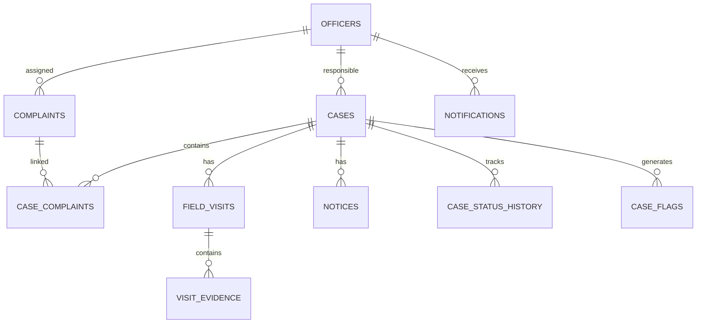

# MCL Building Branch — Proposed Data Architecture & Schema Direction

## Important
This is a proposed implementation direction based on the clarified workflow. It should be reconciled with the current PostgreSQL schema in `ad-dev` / `uv-dev` before migrations are written.

# Core Design Decision

Do not overload one table with every workflow.

Recommended conceptual entities:

- complaints
- cases
- case_complaints
- officers
- officer_assignments
- field_visits
- visit_evidence
- notices
- case_status_history
- case_flags
- notifications

## complaints
Stores the intake record.

Key concepts:
- complaint_id
- registration_source
- title
- description
- location text
- zone/block/ward
- assigned_bi_id
- assigned_atp_id
- status
- created_at

## cases
Stores an enforcement/building-violation matter.

A case may originate from:
- proactive BI inspection
- a complaint that becomes an actionable violation

Key concepts:
- case_id
- source_type
- primary_complaint_id (nullable)
- location/building identity
- latitude
- longitude
- current_status
- current_severity
- assigned_bi_id
- assigned_atp_id
- created_at
- updated_at

## case_complaints
Allows multiple complaints to be associated with the same case.

This supports the requirement that a new complaint about a building with an existing matter becomes an additional record rather than creating an unrelated duplicate case.

## field_visits
Every meaningful BI field interaction should be represented as a visit/update.

Key concepts:
- visit_id
- case_id or complaint_id
- BI officer
- visit type
- description/report
- latitude/longitude
- submitted_at

The application should enforce required evidence and report.

## visit_evidence
Stores one or more evidence items.

Key concepts:
- evidence_id
- visit_id
- file reference
- storage provider reference
- captured metadata
- optional geolocation metadata

## notices
A generalized notice table is preferable to separate hard-coded tables if future notice types may expand.

Key concepts:
- notice_id
- case_id
- notice_type (270 / 269)
- notice_number
- issued_by
- issued_at
- expiry_at
- enforcement_path
- document reference
- metadata

Rules:
- 270 is optional
- 269 occurs at the serious post-expiry stage and should require the necessary data/documents for that stage

## case_status_history
Do not rely only on `current_status`.

Track:
- previous_status
- new_status
- changed_by
- changed_at
- reason/note

This supports:
- accountability
- time-in-state calculations
- analytics
- delayed case detection

## case_flags
Separate from status.

Examples:
- delayed
- high_priority
- escalation

Key concepts:
- flag_id
- case_id
- flag_type
- active
- generated_at
- score
- reason
- resolved_at

## notifications
Stores in-app/PWA notification records.

Key concepts:
- notification_id
- recipient_officer_id
- type
- entity_type
- entity_id
- title
- body
- read_at
- created_at

---

# Conceptual Relationship

# Analytics Data Strategy

Prefer deriving analytics from operational data rather than manually maintaining separate counters.

Primary sources:
- complaints
- cases
- field_visits
- case_status_history
- case_flags
- notices

Potential aggregates can be added later for performance.

# Prototype Migration Priority

1. Inspect current schema
2. Preserve existing complaint functionality
3. Add cases
4. Add case-to-complaint relationship
5. Add field visits and evidence
6. Add status history
7. Add notices
8. Add flags
9. Build analytics queries/views
10. Add notification persistence
