# MCL Building Branch — Final Requirements & Workflow

## Purpose
MCL Building Branch is evolving from an internal complaint-registration application into an internal complaint, building-violation and enforcement tracking system for Municipal Corporation Ludhiana.

This document reflects the workflow clarified during the project discussion. It should take priority over older planning notes where they conflict.

## Core Principles

1. The portal is internal-only. Citizens and violators do not directly use it.
2. Complaints and proactive BI cases are related but remain distinct workflows.
3. BI performs field work and submits evidence/reports.
4. BI cannot change official complaint/case status.
5. ATP controls routine status decisions; serious stages become visible to higher authorities.
6. Every BI update requires evidence image and description/report.
7. Status and escalation flags are separate concepts.
8. Analytics is important for the prototype because non-technical stakeholders are especially interested in it.
9. The application should become a PWA primarily to support notifications.

---

# 1. Complaint Workflow

## Complaint Intake
Complaints may arrive through:
- Email
- Post
- Other external documents
- Manual registration by an officer

At intake, geotagging is **not required**, because the complaint generally originates from the public.

The receiving officer records:
- Location/address
- Zone
- Ward/block and related area information
- Complaint title
- Complaint description
- Source
- Supporting documents/images

The system maps the responsible:
- BI (Building Inspector)
- ATP (Assistant Town Planner)

based on the relevant geographical/administrative area.

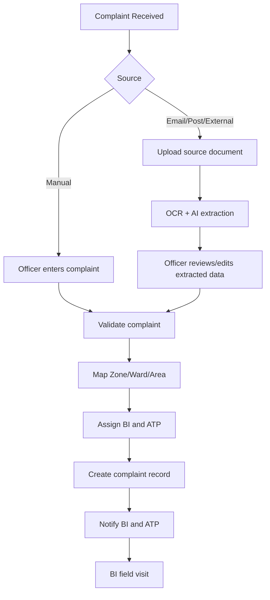

## BI Complaint Visit

The BI visits the location and submits a field update.

Required:
- Evidence image proving the visit
- Description/report explaining the actual situation

The backend must also enforce these requirements.

The image/geotag mechanism still needs final technical implementation. Possible approaches include:
- Capturing through the application/native camera with location capture
- Capturing coordinates separately during submission
- Uploading an existing geotagged image

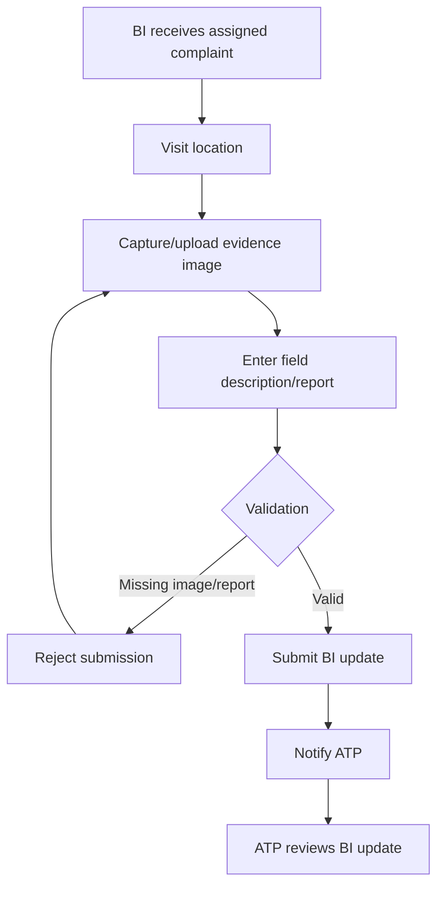

## ATP Decision After BI Update

ATP may:
- Close the complaint if no further action is needed
- Keep it pending if there is an existing/running matter
- Route the matter into the building-violation case flow when appropriate

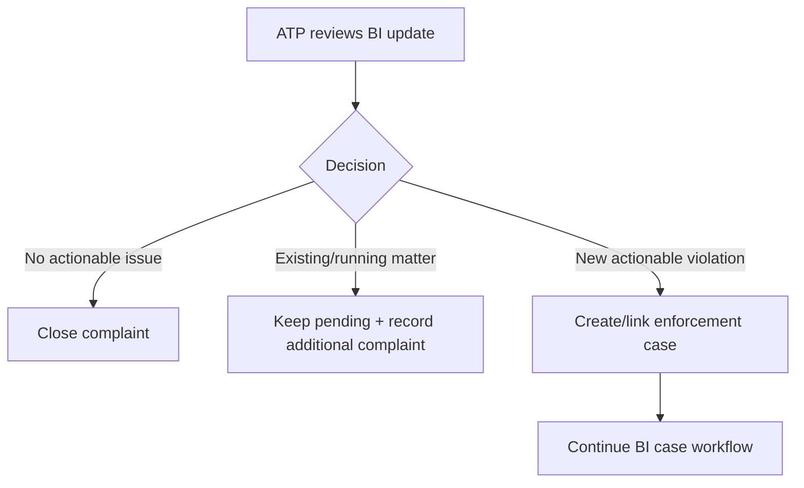

## Existing Case Check

If the location/building already has an existing or running case:
- The complaint is retained as an additional record
- It can be mapped to the existing building/location/case
- It remains pending according to the administrative workflow

If no previous case exists and an actionable violation is found:
- The matter can enter the enforcement/case workflow
- Existing complaint information should be reused where possible so BI does not unnecessarily re-enter known data

---

# 2. Proactive BI Case Workflow

A BI can independently identify a building/violation based on official criteria.

This is **not a complaint**. It is a case initiated through field inspection.

The BI records:
- BI identity
- Zone/administrative information
- Building/location information
- Latitude/longitude
- Evidence images
- Description/report
- Other inspection fields defined by the form/schema

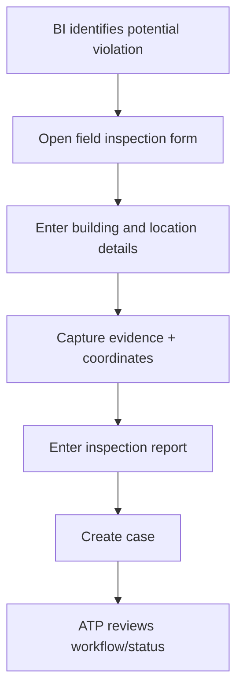

---

# 3. Joining Complaint and Case Workflows

Complaints and proactive BI cases must remain differentiated.

A complaint can:
1. End as a closed complaint
2. Be recorded against an existing case
3. Lead into a new enforcement case

A proactive BI inspection:
- Starts directly as a case
- Does not require a complaint source

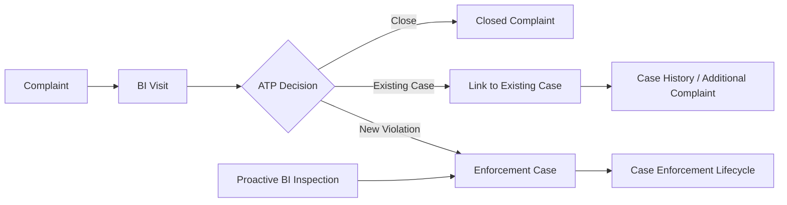

---

# 4. Section 270 Notice

Section 270 is the first optional notice/challan stage.

If BI determines that a notice should be issued:
- BI issues the notice through the official field process
- BI records relevant details in the portal
- Notice number/data is stored
- Image/document of the issued notice is uploaded

If BI determines no notice is required:
- BI still submits required evidence and report
- ATP reviews the matter

Section 270 is optional.

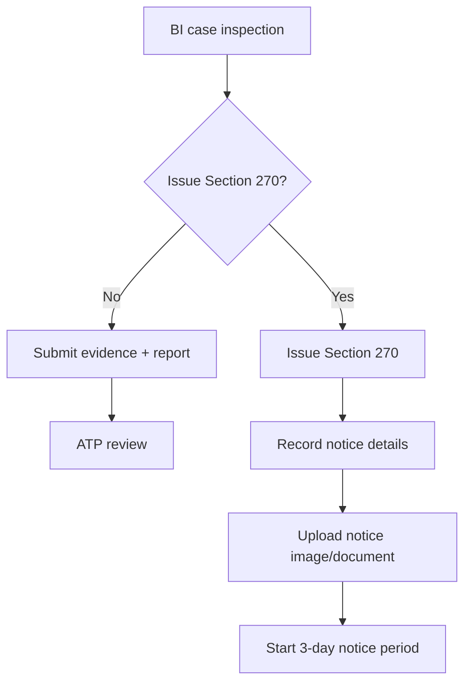

---

# 5. Three-Day Notice Period

After Section 270:
- A 3-day notice period begins
- Future integration may notify the violator through WhatsApp or another channel
- The current portal remains officer-only
- Reminder notifications may be sent before expiry
- BI and ATP are notified when the period expires

If corrective action happens:
- ATP or authorized officers update the official status

If no sufficient action happens:
- BI revisits the location

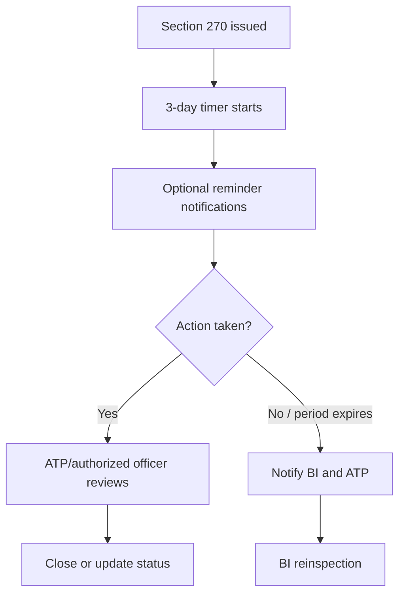

---

# 6. Section 269 Serious Enforcement Stage

After the notice period expires, BI revisits the location.

BI submits:
- Current condition/report
- New field evidence
- Section 269 details
- Relevant enforcement classification/documents

Current remembered classifications are:
- Compoundable
- Non-compoundable
- Demolition

These legal details should be verified later against the official rules/source material before final production implementation.

Section 269 represents a serious stage where further action is required.

After it is issued:
- ATP is notified
- MTP is notified
- JC is notified
- Super Admin visibility/notification is available

The portal tracks status and workflow while official government field/legal actions remain outside the application's scope.

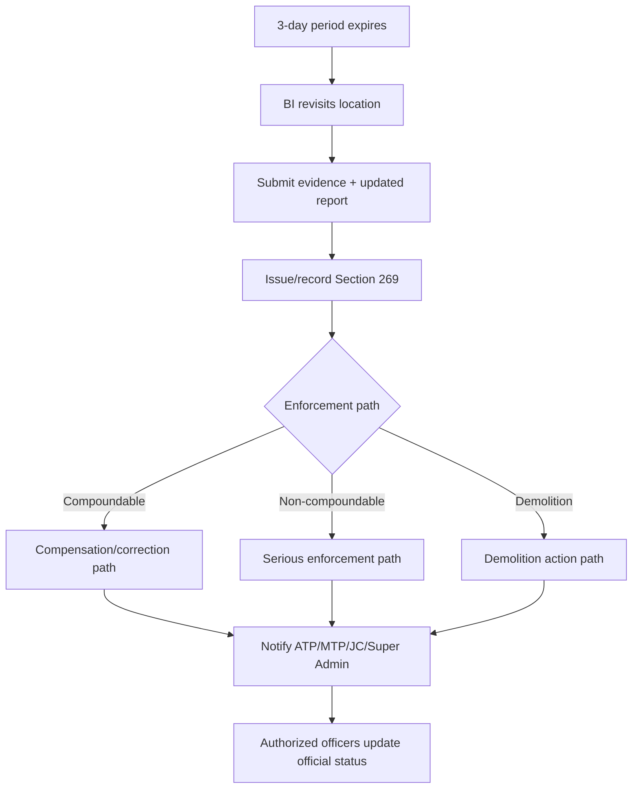

---

# 7. Status Ownership

BI:
- Creates field updates
- Uploads evidence
- Writes reports
- Records notice information
- Does not change official complaint/case status

ATP:
- Reviews BI updates
- Handles routine status decisions
- Closes/keeps pending/routes cases according to authority

MTP / JC / Super Admin:
- Receive visibility and notifications for serious/escalated matters
- Monitor performance and delayed cases
- Take higher-level decisions according to administrative authority

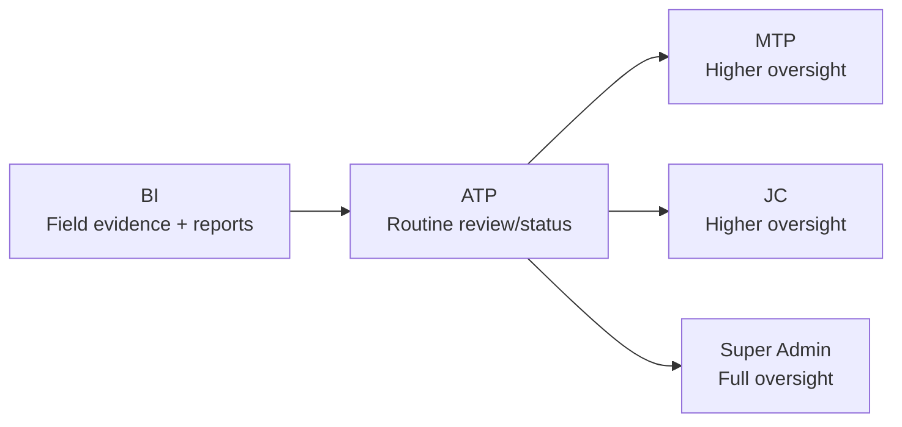

---

# 8. Delayed Case Flagging and Scoring

Flags are separate from status.

Example:
- Status: Pending
- Flag: Escalated/Delayed
- Score: 82

A case should automatically be flagged when it remains in a state too long.

Current discussion baseline:
- Flagging threshold: approximately 3 weeks
- Final thresholds should be configurable later

Flagged cases should:
- Appear in a dedicated analytics section
- Be ranked by score
- Notify relevant higher authorities

Score should consider:
- Time spent in the current state
- Overall case duration
- Severity/stage
- Potentially other administrative factors later

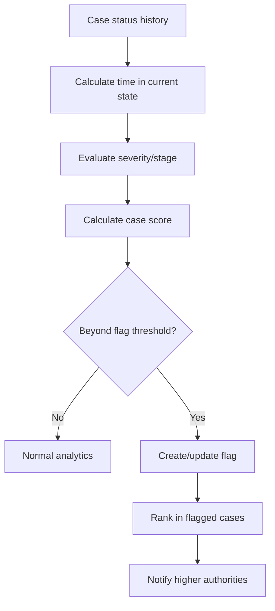

---

# 9. Analytics

Analytics is inside the same application.

Current prototype decision:
- Keep the analytics view broadly the same for ATP, MTP, JC and Super Admin for now
- BI does not receive analytics access
- Exact role-specific analytics permissions can be refined later

Important metrics include:

## BI Performance
- Cases/complaints assigned
- Cases identified
- Cases completed
- Cases closed
- Cases pending
- Daily performance
- Weekly performance
- Monthly performance
- Time spent in stages

## ATP Performance
ATP performance should reflect the performance of BIs under the ATP's responsibility.

## Oversight
MTP, JC and Super Admin need visibility to:
- BI performance
- ATP performance
- Pending cases
- Flagged/delayed cases
- High-severity cases
- Case pipeline trends

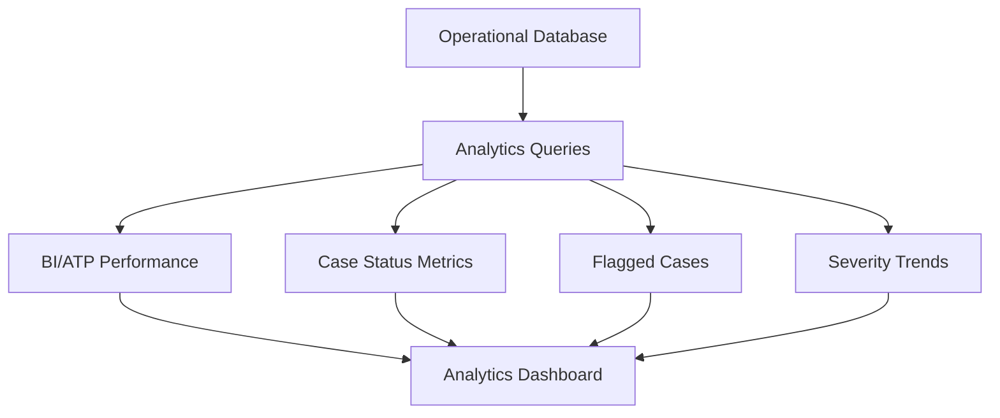

---

# 10. PWA and Notifications

The application should be implemented as a PWA.

The immediate PWA focus is notifications rather than broad offline functionality.

Notification examples:
- Complaint assigned
- BI update submitted
- ATP review required
- Section 270 notice period reminder
- Notice period expired
- Section 269 serious stage
- Case delayed for approximately 3 weeks
- Escalation/flagged case

Future:
- WhatsApp integration for violator reminders
- Additional external notification channels

---

# 11. Prototype Goal

The prototype should demonstrate a convincing end-to-end story to non-technical stakeholders.

Priority demonstration:
1. Register a complaint
2. Map BI and ATP
3. BI performs visit
4. BI uploads required evidence and report
5. ATP reviews
6. Show complaint close/pending/case routing
7. Show proactive BI case creation
8. Demonstrate Section 270 path
9. Demonstrate notice expiry and reinspection concept
10. Demonstrate Section 269 serious stage
11. Show real-data analytics
12. Show delayed/flagged cases ranked by score
13. Demonstrate basic notification/PWA readiness where feasible

## Out of Scope for Initial Prototype
- Complete public/citizen portal
- Full WhatsApp integration
- Final legal automation of government field actions
- Perfect role-specific analytics
- Final legal validation of every Section 269 rule
